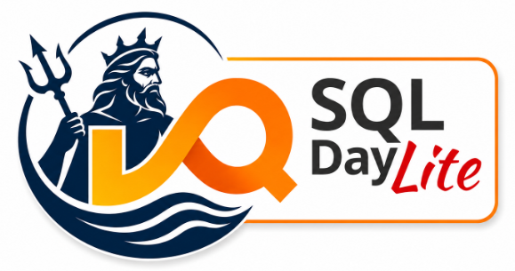
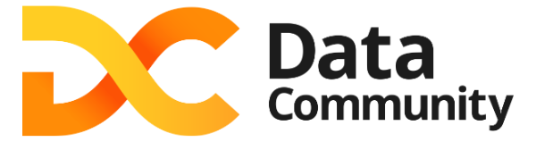
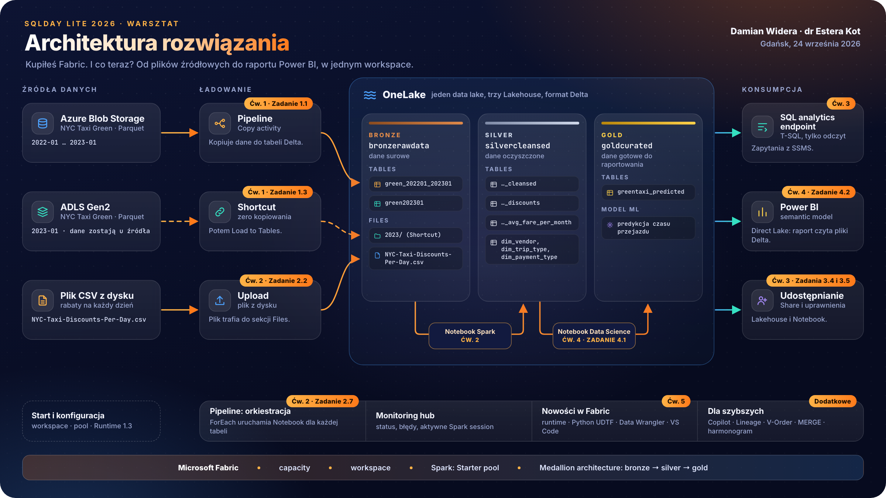

  
  &nbsp;&nbsp;&nbsp;&nbsp;
  

# Kupiłeś Fabric. I co teraz? Praktyczny warsztat dla osób od Power BI, SQL i Excela

## Spis treści

1. [Dla kogo](#dla-kogo)
2. [Co przygotować](#co-przygotować)
3. [Czego się nauczysz](#czego-się-nauczysz)
4. [Agenda](#agenda)
5. [Najczęstsze błędy początkujących](#najczęstsze-błędy-początkujących)
6. [Twoja opinia](#twoja-opinia)
7. [FAQ 1: słowniczek pojęć Fabric](#faq-1-słowniczek-pojęć-fabric)
8. [FAQ 2: mam taki scenariusz, co zrobić w Fabric](#faq-2-mam-taki-scenariusz-co-zrobić-w-fabric)

Witamy na warsztacie [SQLDay Lite 2026](https://sqlday.pl/lite/). Warsztat odbywa się w czwartek, 24 września 2026, na Politechnice Gdańskiej (Wydział Elektroniki, Telekomunikacji i Informatyki, ul. Gabriela Narutowicza 11/12, Gdańsk). Konferencja odbywa się dzień później, 25 września.

**Prowadzący:** Damian Widera i dr Estera Kot.
**Format:** cały dzień (8 godzin), slajdy i ćwiczenia dla uczestników. Poziom 300. Warsztat prowadzimy po polsku.

Microsoft Fabric wygląda prosto, dopóki nie trzeba zbudować pierwszego sensownego rozwiązania. Wtedy pojawiają się pytania. Lakehouse czy Warehouse? Dataflow czy Notebook? Pipeline czy ręczne odświeżanie? Gdzie właściwie są dane? Czy Power BI dalej działa tak samo? Co z uprawnieniami, odświeżaniem, kosztami i wersjonowaniem?

Na tym warsztacie zbudujesz od zera małe, kompletne rozwiązanie analityczne. Załadujesz dane, zapiszesz je w OneLake, oczyścisz, zamodelujesz i pokażesz w raporcie Power BI. Po drodze wyjaśnimy, które elementy Fabric są potrzebne na początku, a które można zostawić na później.

> [!IMPORTANT]
> Instrukcje do ćwiczeń są po polsku. Nazwy funkcji Fabric, przycisków i opcji zostawiamy po angielsku, tak jak na zrzutach ekranu i w interfejsie. Dzięki temu na ekranie znajdziesz dokładnie to, co widzisz w instrukcji.

---

**Cele warsztatu**
- Zbudować kompletny przepływ danych w Microsoft Fabric: ładowanie, przygotowanie, udostępnienie.
- Zrozumieć, gdzie w Fabric trafiają dane i jak widzą je różne narzędzia.
- Nauczyć się podejmować pierwsze decyzje projektowe i nie zbudować bałaganu już pierwszego dnia.

**Scenariusz: dane o przejazdach taksówek w Nowym Jorku**
- Pracujemy na publicznych danych NYC Taxi. To duży, prawdziwy zbiór, który dobrze pokazuje różnicę między plikiem w Excelu a tabelą w Lakehouse.
- Dane układamy w trzech warstwach: surowe (bronze), oczyszczone (silver) i gotowe do raportowania (gold).
- Na końcu powstaje semantic model i raport Power BI w trybie Direct Lake.

Na początku każdego ćwiczenia zobaczysz ten sam diagram z podświetlonym fragmentem, nad którym właśnie pracujesz.

# Dla kogo

Warsztat jest dla osób, które zaczynają pracę z Microsoft Fabric albo znają Fabric tylko z poziomu Power BI. Najbardziej skorzystają:

- analitycy Power BI,
- osoby pracujące z SQL,
- użytkownicy Excela, Power Query i prostych procesów raportowych,
- deweloperzy BI,
- początkujący inżynierzy danych,
- konsultanci, którzy chcą uporządkować podstawy Fabric.

Nie musisz znać Sparka, Pythona, DevOps, Gita ani zaawansowanej architektury danych. Notebooki do ćwiczeń są gotowe. Uruchamiasz je komórka po komórce, a my tłumaczymy, co się dzieje.

# Co przygotować

- Laptop z aktualną przeglądarką. Polecamy tryb incognito, żeby przeglądarka nie logowała cię do firmowego tenanta.
- Konto do Fabric dostaniesz od nas na miejscu. Nie potrzebujesz własnej licencji ani własnej capacity.
- Opcjonalnie: SQL Server Management Studio (SSMS) do ćwiczenia 3 oraz Power BI Desktop.

# Czego się nauczysz

| Pytanie z opisu warsztatu | Gdzie na nie odpowiadamy |
| --- | --- |
| Gdzie właściwie są dane? Czym jest OneLake, Files i Tables? | [Ćwiczenie 1](./exercise-1/exercise-1.md) |
| Do czego służy Pipeline i gdzie monitorować wykonania i błędy? | [Ćwiczenie 1](./exercise-1/exercise-1.md), [ćwiczenia dodatkowe](./exercise-extra/extra.md) |
| Jak podzielić dane na surowe, oczyszczone i gotowe do raportowania? | [Konwencja nazw](./exercise-0-setup/naming-convention.md), [Ćwiczenie 2](./exercise-2/exercise-2.md) |
| Kiedy Notebook, a kiedy Dataflow Gen2? | [Ćwiczenie 2](./exercise-2/exercise-2.md), [Ćwiczenie 2B](./exercise-2/exercise-2b-dataflow-gen2.md), [Decyzje projektowe](./decyzje-projektowe.md#2-dataflow-gen2-czy-notebook) |
| Kiedy wystarczy Lakehouse, a kiedy myśleć o Warehouse? Jak pracować w T-SQL? | [Ćwiczenie 3](./exercise-3/exercise-3.md), [Decyzje projektowe](./decyzje-projektowe.md#1-lakehouse-czy-warehouse) |
| Co z uprawnieniami i udostępnianiem? | [Ćwiczenie 3](./exercise-3/exercise-3.md) |
| Czy Power BI dalej działa tak samo? Semantic model, Direct Lake, raport. | [Ćwiczenie 4](./exercise-4/exercise-4.md) |
| Jak zautomatyzować odświeżanie? | [Ćwiczenie 2, zadanie 2.7](./exercise-2/exercise-2.md), [ćwiczenia dodatkowe](./exercise-extra/extra.md) |
| Co z kosztami i wydajnością? | [Ćwiczenie 5](./exercise-5/exercise-5.md) |

# Agenda

> [!TIP]
> Ćwiczenia możesz robić we własnym tempie. Przerwy są propozycją. Jeśli wolisz pracować dalej, pracuj dalej.

**Godziny dopasujemy do tempa grupy i do harmonogramu organizatora.** ⟦TBC godziny startu, przerw i lunchu po publikacji harmonogramu SQLDay Lite⟧

> [!IMPORTANT]
> 08:30–09:15 (45 min) - Wprowadzenie, konfiguracja i przegląd platformy Fabric
>
> 1. Login i hasło do Fabric: https://docs.google.com/spreadsheets/d/12snhUR6lOkVuyQ0qdyYEApFNcoy_2FkITNCDWDo5m7M/edit?usp=sharing 
> 2. [Start i konfiguracja](exercise-0-setup/start.md)
> 3. Otwórz i miej pod ręką [konwencję nazw](./exercise-0-setup/naming-convention.md).
>
> 09:15–10:35 (80 min) - [Ćwiczenie 1 - Ładowanie danych: Pipeline i Shortcut](./exercise-1/exercise-1.md)
>
> 10:35–10:50 (15 min) - Przerwa kawowa
>
> 10:50–12:05 (75 min) - [Ćwiczenie 2 - Transformacja danych w Notebookach i na klastrach Spark](./exercise-2/exercise-2.md)
>
> 12:05–12:20 (15 min) - [Ćwiczenie 2B - Dataflow Gen2: ta sama transformacja bez kodu](./exercise-2/exercise-2b-dataflow-gen2.md)
>
> 12:20–13:00 (40 min) - [Ćwiczenie 3 - SQL analytics endpoint, SSMS, udostępnianie i uprawnienia](./exercise-3/exercise-3.md)
>
> 13:00–14:00 (60 min) - Lunch
>
> 14:00–15:20 (80 min) - [Ćwiczenie 4 - Semantic model i raport Power BI](./exercise-4/exercise-4.md)
>
> 15:20–15:35 (15 min) - Przerwa
>
> 15:35–16:35 (60 min) - [Ćwiczenie 5 - Nowości w Fabric i Data Wrangler](./exercise-5/exercise-5.md)
>
> 16:35–17:30 (55 min) - [Finał: pokaż swój raport](./zakonczenie.md), najczęstsze błędy początkujących, [ankieta](#twoja-opinia), pytania i odpowiedzi

# Najczęstsze błędy początkujących

Ten blok zamyka dzień. Omawiamy błędy, które widzimy w pierwszych projektach Fabric. Objawy, skutki i sposoby uniknięcia każdego błędu znajdziesz na stronie [Finał](./zakonczenie.md#3-najczęstsze-błędy-początkujących-20-minut).

- raportowanie na brudnych danych,
- mieszanie warstw,
- nadmiar narzędzi w jednym rozwiązaniu,
- brak konwencji nazw,
- zbyt szerokie uprawnienia,
- brak kontroli kosztów.

Pierwsze decyzje projektowe opisuje osobna strona: [Decyzje projektowe](./decyzje-projektowe.md). Wersja na jedną kartkę to [ściąga PDF](./assets/cheatsheet/sciaga-fabric.pdf).

# Twoja opinia

Na koniec dnia wypełnij krótką ankietę o warsztacie. Zeskanuj kod QR albo otwórz [formularz](https://forms.cloud.microsoft/e/hXHYaB8pDb). Twoje odpowiedzi pomogą nam poprawić kolejną edycję.

# FAQ 1: słowniczek pojęć Fabric

Nazwy zostawiamy po angielsku, bo tak wyglądają w interfejsie. Wyjaśnienia mówią, co dane pojęcie znaczy w Fabric, a nie ogólnie w IT.

| ID | Pojęcie | Co znaczy w Fabric |
| :- | :- | :- |
| G01 | tenant | Twoja organizacja w chmurze Microsoft. Jeden tenant ma jeden OneLake i wspólne ustawienia w Admin portal. |
| G02 | capacity | Pula mocy obliczeniowej, którą kupuje firma. Wszystko, co uruchamiasz w Fabric, zużywa capacity przypisaną do workspace. |
| G03 | SKU F | Rozmiar kupionej capacity, np. F2, F64. Liczba oznacza capacity units (CU). Jedna CU to dwa Spark VCores. |
| G04 | trial capacity | Bezpłatna capacity testowa, odpowiednik F64. Część funkcji na niej nie działa, np. Copilot i kolejkowanie Spark job. |
| G05 | workspace | Kontener na elementy jednego projektu lub zespołu. Tu nadajesz role i tu przypisujesz capacity. |
| G06 | item | Każdy obiekt w workspace: Lakehouse, Notebook, Pipeline, semantic model, raport. |
| G07 | OneLake | Jeden logiczny data lake dla całego tenanta. Każdy Lakehouse i Warehouse zapisuje dane właśnie tam. |
| G08 | Lakehouse | Item, który łączy pliki i tabele. Dane zapisujesz przez Spark, Pipeline albo Dataflow Gen2, a czytasz także przez SQL. |
| G09 | Files | Część Lakehouse na dowolne pliki: CSV, Parquet, JSON, obrazy. Tych plików nie widzi SQL analytics endpoint. |
| G10 | Tables | Część Lakehouse na tabele Delta. Tylko one są widoczne w SQL analytics endpoint i w Power BI. |
| G11 | Delta table | Tabela zapisana jako pliki Parquet oraz dziennik transakcji `_delta_log`. To domyślny format tabel w Fabric. |
| G12 | Lakehouse schemas | Grupowanie tabel w Lakehouse w schema, np. `sales.orders`. Pole jest domyślnie zaznaczone przy tworzeniu Lakehouse. Na tym warsztacie je odznaczamy. |
| G13 | Warehouse | Hurtownia danych z pełnym T-SQL, czyli także INSERT, UPDATE i DELETE. Dane też leżą w OneLake jako Delta. |
| G14 | SQL analytics endpoint | Widok T-SQL na tabele Lakehouse, tylko do odczytu. Powstaje automatycznie razem z Lakehouse. |
| G15 | Shortcut | Wskaźnik na dane, które leżą gdzie indziej: w innym Lakehouse, ADLS Gen2, S3. Dane widzisz u siebie, ale ich nie kopiujesz. |
| G16 | Pipeline | Orkiestracja: uruchamia kroki w ustalonej kolejności, według harmonogramu, z ponawianiem. Sam nie przekształca danych. |
| G17 | Copy activity | Krok w Pipeline, który kopiuje dane ze źródła do miejsca docelowego. |
| G18 | Dataflow Gen2 | Transformacje w Power Query, bez pisania kodu. Naturalny wybór dla osób od Power BI i Excela. |
| G19 | Notebook | Kod w PySpark, Spark SQL, Scala albo R, uruchamiany komórka po komórce. Wybór do dużych danych i złożonej logiki. |
| G20 | Spark session | Uruchomione środowisko Spark dla twojego Notebooka. Zużywa capacity, dopóki trwa. Bez aktywności wygasa po 20 minutach. |
| G21 | Starter pool | Rozgrzane klastry Spark, dzięki którym Spark session startuje w kilka sekund. |
| G22 | Spark pool (custom pool) | Klaster o rozmiarze, który ustawiasz samodzielnie. Startuje kilka minut. |
| G23 | runtime | Zestaw wersji: Spark, Delta Lake, Python, Java. Na warsztacie używamy Runtime 1.3. |
| G24 | Environment | Item z ustawieniami Spark: runtime, biblioteki, właściwości. Podpinasz go do Notebooka albo do całego workspace. |
| G25 | semantic model | Model danych dla Power BI: tabele, relacje, miary. Dawna nazwa to dataset. Fabric nie tworzy go już automatycznie. |
| G26 | Direct Lake | Tryb semantic model, w którym Power BI czyta pliki Delta prosto z OneLake. Nie importujesz danych i nie odpytujesz źródła przy każdym kliknięciu. |
| G27 | Import mode i DirectQuery | Dwa klasyczne tryby Power BI. Import mode kopiuje dane do modelu przy odświeżaniu. DirectQuery wysyła zapytanie do źródła przy każdej interakcji. |
| G28 | Medallion architecture | Podział danych na warstwy: bronze (surowe), silver (oczyszczone), gold (gotowe do raportowania). |
| G29 | V-Order | Optymalizacja plików Parquet pod szybki odczyt, głównie dla Power BI. W nowych workspace jest domyślnie wyłączona. |
| G30 | Monitoring hub | Jedno miejsce z historią uruchomień: Pipeline, Notebook, odświeżenia. Tu sprawdzasz błędy i anulujesz Spark session. |
| G31 | throttling (HTTP 430) | Fabric odrzuca nowy Spark job, bo capacity jest w pełni zajęta. Pomaga anulowanie zbędnych Spark session. |
| G32 | Lineage | Widok zależności między items: skąd dane przyszły i co z nich korzysta. |
| G33 | Data Wrangler | Narzędzie w Notebooku do czyszczenia danych klikaniem. Na końcu generuje kod Pandas albo PySpark. |
| G34 | Copilot | Asystent AI w Notebooku, Power BI i innych miejscach Fabric. Wymaga płatnej capacity. |
| G35 | Managed Private Endpoints | Prywatne połączenie Spark ze źródłem danych za firewallem. Włączenie wyłącza Starter pool w workspace. |

# FAQ 2: mam taki scenariusz, co zrobić w Fabric

Lista łączy typowe potrzeby klienta z elementem Fabric i z miejscem w warsztacie, gdzie to ćwiczymy.

| ID | Scenariusz klienta | Co zrobić w Fabric | Gdzie w warsztacie |
| :- | :- | :- | :- |
| S01 | Mam pliki CSV albo Excel na dysku. | Prześlij plik do Files w Lakehouse i użyj Load to Tables. Powstanie tabela Delta. | [Zadanie 2.2](./exercise-2/exercise-2.md) |
| S02 | Dane leżą już w ADLS Gen2, S3 albo w innym Lakehouse. Nie chcę ich kopiować. | Utwórz Shortcut. Dane zostają u źródła, a ty widzisz je jak własne. | [Zadanie 1.3](./exercise-1/exercise-1.md#zadanie-13-utwórz-shortcut) |
| S03 | Muszę regularnie pobierać dane z bazy albo z Azure Blob Storage. | Zbuduj Pipeline z Copy activity i dodaj harmonogram. | [Zadanie 1.1](./exercise-1/exercise-1.md) |
| S04 | Znam Power Query, nie znam Pythona. Muszę oczyścić dane. | Użyj Dataflow Gen2 i zapisz wynik do Lakehouse. Alternatywa to Data Wrangler, który wygeneruje kod za ciebie. | [Ćwiczenie 2B](./exercise-2/exercise-2b-dataflow-gen2.md), [Data Wrangler](./exercise-5/exercise-5.md#zaprzyjaźnij-się-z-data-wrangler) |
| S05 | Danych jest dużo albo logika jest złożona. | Napisz transformacje w Notebooku na Spark. Wynik zapisz jako tabelę Delta w warstwie silver. | [Ćwiczenie 2](./exercise-2/exercise-2.md) |
| S06 | Znam SQL i chcę po prostu odpytać dane. | Połącz się z SQL analytics endpoint z SSMS albo z edytora SQL w Fabric. To dostęp tylko do odczytu. | [Zadania 3.1 do 3.3](./exercise-3/exercise-3.md) |
| S07 | Potrzebuję INSERT, UPDATE i procedur w T-SQL. | Wybierz Warehouse zamiast Lakehouse. SQL analytics endpoint nie pozwala na zapis. | [Decyzje projektowe](./decyzje-projektowe.md#1-lakehouse-czy-warehouse) |
| S08 | Chcę raport Power BI na dużych danych, bez długiego odświeżania. | Utwórz semantic model w trybie Direct Lake na tabelach gold. | [Zadanie 4.2](./exercise-4/exercise-4.md) |
| S09 | Proces ma się uruchamiać sam, np. co noc. | Złóż kroki w Pipeline i ustaw harmonogram. Pojedynczy Notebook też ma własny harmonogram. | [Zadanie 2.7](./exercise-2/exercise-2.md#zadanie-27-automatyzacja), [harmonogram Notebooka](./exercise-extra/extra.md#zaplanuj-uruchamianie-notebooka-kilka-razy-dziennie) |
| S10 | Coś się nie wykonało. Gdzie szukać przyczyny? | Otwórz Monitoring hub. Znajdziesz tam status, czas trwania i komunikat błędu każdego uruchomienia. | [Monitoring](./exercise-extra/extra.md#monitoruj-uruchomienie-pipeline-i-sprawdź-wynik) |
| S11 | Analityk ma tylko czytać dane, bez dostępu do całego workspace. | Udostępnij sam Lakehouse przyciskiem Share i zaznacz `Read all with SQL analytics endpoint`. Nie nadawaj roli w workspace. | [Zadanie 3.4](./exercise-3/exercise-3.md#zadanie-34-udostępnij-lakehouse) |
| S12 | Kilka osób ma pracować nad jednym Notebookiem. | Udostępnij Notebook z uprawnieniem Edit albo Run. | [Zadanie 3.5](./exercise-3/exercise-3.md#zadanie-35-udostępnij-notebook-do-współpracy) |
| S13 | Boję się bałaganu w danych już po miesiącu. | Od pierwszego dnia trzymaj się warstw bronze, silver, gold i jednej konwencji nazw. Raporty buduj tylko na gold. | [Konwencja nazw](./exercise-0-setup/naming-convention.md), [Medallion architecture](./exercise-extra/extra.md#medallion-architecture) |
| S14 | Boję się kosztów. | Zmniejsz domyślny Spark pool, zatrzymuj nieużywane Spark session i wstrzymuj capacity z SKU F, gdy nikt nie pracuje. | [Start, krok 13](./exercise-0-setup/start.md), [Zadanie 1.4](./exercise-1/exercise-1.md#zadanie-14-zarządzanie-spark-session) |
| S15 | Notebook zwraca błąd HTTP 430. | Capacity jest zajęta. Anuluj zbędne Spark session w Monitoring hub, zmniejsz pool albo uruchom job później. | [Zadanie 1.4](./exercise-1/exercise-1.md#zadanie-14-zarządzanie-spark-session) |
| S16 | Chcę wersjonować pracę w Git. | Połącz workspace z repozytorium w Azure DevOps albo GitHub w ustawieniach workspace (Git integration). | Poza ćwiczeniami, [dokumentacja](https://learn.microsoft.com/fabric/cicd/git-integration/intro-to-git-integration) |
| S17 | Źródło danych stoi za firewallem. | Utwórz Managed Private Endpoint w ustawieniach workspace i poproś właściciela źródła o zatwierdzenie. | [Ćwiczenie 5, demo](./exercise-5/exercise-5.md#managed-private-endpoints) |
| S18 | Chcę wiedzieć, skąd pochodzą dane w raporcie. | Otwórz widok Lineage w workspace. | [Lineage](./exercise-extra/extra.md#lineage) |
