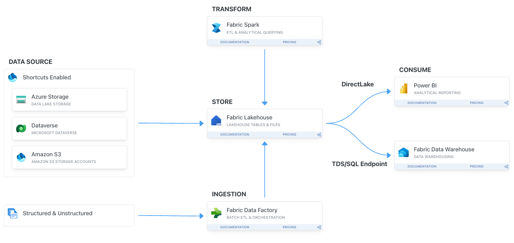

# Kupiłeś Fabric. I co teraz? Praktyczny warsztat dla osób od Power BI, SQL i Excela

Witamy na warsztacie [SQLDay Lite 2026](https://sqlday.pl/lite/). Warsztat odbywa się w czwartek, 24 września 2026, na Politechnice Gdańskiej (Wydział Elektroniki, Telekomunikacji i Informatyki, ul. Gabriela Narutowicza 11/12, Gdańsk). Konferencja odbywa się dzień później, 25 września.

**Prowadzący:** Damian Widera i dr Estera Kot.
**Format:** cały dzień (8 godzin), slajdy i ćwiczenia dla uczestników. Poziom 300. Warsztat prowadzimy po polsku.

Microsoft Fabric wygląda prosto, dopóki nie trzeba zbudować pierwszego sensownego rozwiązania. Wtedy pojawiają się pytania. Lakehouse czy Warehouse? Dataflow czy Notebook? Pipeline czy ręczne odświeżanie? Gdzie właściwie są dane? Czy Power BI dalej działa tak samo? Co z uprawnieniami, odświeżaniem, kosztami i wersjonowaniem?

Na tym warsztacie zbudujesz od zera małe, kompletne rozwiązanie analityczne. Pobierzesz dane, zapiszesz je w OneLake, oczyścisz, zamodelujesz i pokażesz w raporcie Power BI. Po drodze wyjaśnimy, które elementy Fabric są potrzebne na początku, a które można zostawić na później.

> [!IMPORTANT]
> Instrukcje do ćwiczeń i zrzuty ekranu są po angielsku, tak jak interfejs Fabric. Prowadzący tłumaczą każdy krok po polsku.

> [!IMPORTANT]
> Grupa uczestników do pytań i linków: ⟦TBC link do grupy⟧

---

**Cele warsztatu**
- Zbudować kompletny przepływ danych w Microsoft Fabric: pobranie, przygotowanie, udostępnienie.
- Zrozumieć, gdzie w Fabric trafiają dane i jak widzą je różne narzędzia.
- Nauczyć się podejmować pierwsze decyzje projektowe i nie zbudować bałaganu już pierwszego dnia.

**Scenariusz: dane o przejazdach taksówek w Nowym Jorku**
- Pracujemy na publicznych danych NYC Taxi. To duży, prawdziwy zbiór, który dobrze pokazuje różnicę między plikiem w Excelu a tabelą w Lakehouse.
- Dane układamy w trzech warstwach: surowe (bronze), oczyszczone (silver) i gotowe do raportowania (gold).
- Na końcu powstaje model semantyczny i raport Power BI w trybie Direct Lake.

# Dla kogo

Warsztat jest dla osób, które zaczynają pracę z Microsoft Fabric albo znają Fabric tylko z poziomu Power BI. Najbardziej skorzystają:

- analitycy Power BI,
- osoby pracujące z SQL,
- użytkownicy Excela, Power Query i prostych procesów raportowych,
- BI developerzy,
- początkujący data engineerowie,
- konsultanci, którzy chcą uporządkować podstawy Fabric.

Nie musisz znać Sparka, Pythona, DevOps, Gita ani zaawansowanej architektury danych. Notebooki do ćwiczeń są gotowe. Uruchamiasz je komórka po komórce, a my tłumaczymy, co się dzieje.

# Co przygotować

- Laptop z aktualną przeglądarką. Polecamy tryb incognito, żeby przeglądarka nie logowała Cię do firmowego tenanta.
- Konto do Fabric dostaniesz od nas na miejscu. Nie potrzebujesz własnej licencji ani własnej capacity.
- Opcjonalnie: SQL Server Management Studio (SSMS) do ćwiczenia 3 oraz Power BI Desktop.

# Czego się nauczysz

| Pytanie z opisu warsztatu | Gdzie na nie odpowiadamy |
| --- | --- |
| Gdzie właściwie są dane? Czym jest OneLake, Files i Tables? | [Ćwiczenie 1](./exercise-1/exercise-1.md) |
| Do czego służy Pipeline i gdzie monitorować wykonania i błędy? | [Ćwiczenie 1](./exercise-1/exercise-1.md), [ćwiczenia dodatkowe](./exercise-extra/extra.md) |
| Jak podzielić dane na surowe, oczyszczone i gotowe do raportowania? | [Konwencja nazw](./exercise-0-setup/naming-convention.md), [Ćwiczenie 2](./exercise-2/exercise-2.md) |
| Kiedy Notebook, a kiedy Dataflow Gen2? | [Ćwiczenie 2](./exercise-2/exercise-2.md) i dyskusja z prowadzącymi |
| Kiedy wystarczy Lakehouse, a kiedy myśleć o Warehouse? Jak pracować w T-SQL? | [Ćwiczenie 3](./exercise-3/exercise-3.md) i dyskusja z prowadzącymi |
| Co z uprawnieniami i udostępnianiem? | [Ćwiczenie 3](./exercise-3/exercise-3.md) |
| Czy Power BI dalej działa tak samo? Model semantyczny, Direct Lake, raport. | [Ćwiczenie 4](./exercise-4/exercise-4.md) |
| Jak zautomatyzować odświeżanie? | [Ćwiczenie 2, zadanie 2.7](./exercise-2/exercise-2.md), [ćwiczenia dodatkowe](./exercise-extra/extra.md) |
| Co z kosztami i wydajnością? | [Ćwiczenie 5](./exercise-5/exercise-5.md) |

# Agenda

> [!TIP]
> Ćwiczenia możesz robić we własnym tempie. Przerwy są propozycją. Jeśli wolisz pracować dalej, pracuj dalej.

**Godziny dopasujemy do tempa grupy i do harmonogramu organizatora.** ⟦TBC godziny startu, przerw i lunchu po publikacji harmonogramu SQLDay Lite⟧

> [!IMPORTANT]
> 08:30 – 09:15 (45 min) - Wprowadzenie, konfiguracja i przegląd platformy Fabric
>
> 1. Login i hasło do Fabric: ⟦TBC lista loginów dla uczestników⟧
> 2. [Start & Setup](exercise-0-setup/start.md)
> 3. Otwórz i miej pod ręką [konwencję nazw](/exercise-0-setup/naming-convention.md).
>
> 09:15 – 10:35 (80 min) - [Ćwiczenie 1 - Pobieranie danych: pipeline i shortcuty](./exercise-1/exercise-1.md)
>
> 10:35 – 10:50 (15 min) - Przerwa kawowa
>
> 10:50 – 12:20 (90 min) - [Ćwiczenie 2 - Transformacje danych w Notebooku](./exercise-2/exercise-2.md)
>
> 12:20 – 13:00 (40 min) - [Ćwiczenie 3 - SQL analytics endpoint, SSMS, udostępnianie i uprawnienia](./exercise-3/exercise-3.md)
>
> 13:00 – 14:00 (60 min) - Lunch
>
> 14:00 – 15:20 (80 min) - [Ćwiczenie 4 - Model semantyczny i raport Power BI](./exercise-4/exercise-4.md)
>
> 15:20 – 15:35 (15 min) - Przerwa
>
> 15:35 – 16:35 (60 min) - [Ćwiczenie 5 - Nowości w Fabric i Data Wrangler](./exercise-5/exercise-5.md)
>
> 16:35 – 17:30 (55 min) - Najczęstsze błędy początkujących, pytania i odpowiedzi, [ćwiczenia dodatkowe](exercise-extra/extra.md)

# Najczęstsze błędy początkujących

Ten blok zamyka dzień. Omawiamy błędy, które widzimy w pierwszych projektach Fabric:

- raportowanie na brudnych danych,
- mieszanie warstw,
- nadmiar narzędzi w jednym rozwiązaniu,
- brak konwencji nazw,
- zbyt szerokie uprawnienia,
- brak kontroli kosztów.
