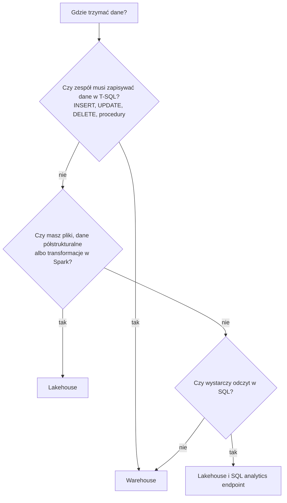
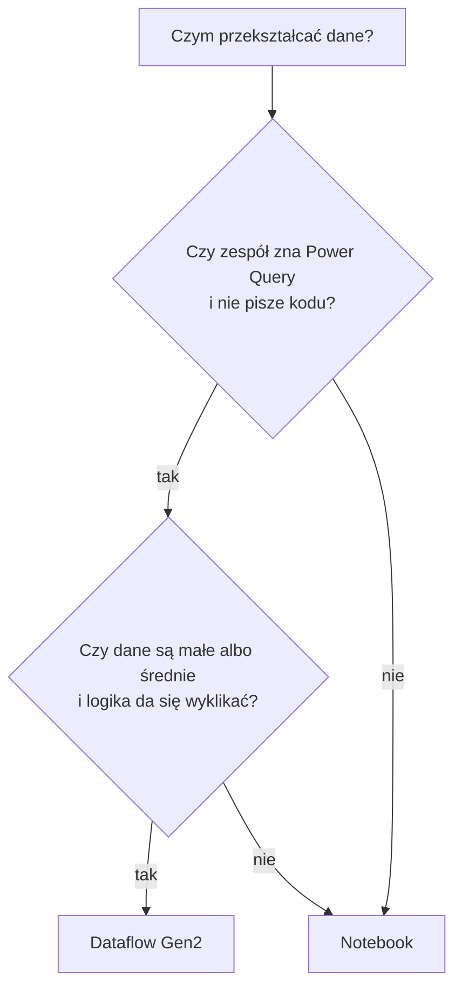
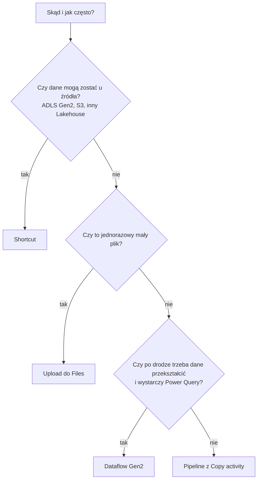

# Decyzje projektowe: pierwszy projekt w Fabric

> [!NOTE]
> [Powrót do agendy](./README.md#agenda) | [Słowniczek pojęć](./README.md#faq-1-słowniczek-pojęć-fabric) | [Scenariusze klienta](./README.md#faq-2-mam-taki-scenariusz-co-zrobić-w-fabric)

Ta strona odpowiada na pytania z tytułu warsztatu. Każda decyzja ma krótkie drzewko, tabelę i wskazanie, gdzie ćwiczysz dany element. Wersję do druku znajdziesz w pliku [ściąga PDF](./assets/cheatsheet/sciaga-fabric.pdf).

Zasada na start: wybierz najprostszy element, który rozwiązuje twój problem. Każdy kolejny element to kolejna rzecz do utrzymania, monitorowania i opłacenia.

## Spis decyzji

1. [Lakehouse czy Warehouse?](#1-lakehouse-czy-warehouse)
2. [Dataflow Gen2 czy Notebook?](#2-dataflow-gen2-czy-notebook)
3. [Jak dostarczyć dane do Fabric?](#3-jak-dostarczyć-dane-do-fabric)
4. [Pipeline czy harmonogram jednego elementu?](#4-pipeline-czy-harmonogram-jednego-elementu)
5. [Który tryb semantic model w Power BI?](#5-który-tryb-semantic-model-w-power-bi)
6. [Co zostawić na później?](#6-co-zostawić-na-później)

## 1. Lakehouse czy Warehouse?

| ID | Kryterium | Lakehouse | Warehouse |
| :- | :- | :- | :- |
| D1.1 | Jak zapisujesz dane | Spark, Pipeline, Dataflow Gen2 | T-SQL, Pipeline, Dataflow Gen2 |
| D1.2 | SQL | tylko odczyt przez SQL analytics endpoint | pełny T-SQL z zapisem |
| D1.3 | Rodzaj danych | pliki i tabele Delta | tabele |
| D1.4 | Kto się w tym odnajdzie | data engineer, osoba znająca Python | osoba znająca SQL Server |
| D1.5 | Format w OneLake | Delta | Delta |

Oba elementy zapisują dane w OneLake w formacie Delta. Możesz więc zacząć od Lakehouse i dodać Warehouse później, bez kopiowania danych. Ćwiczysz to w [Ćwiczeniu 1](./exercise-1/exercise-1.md) i w [Ćwiczeniu 3](./exercise-3/exercise-3.md).

## 2. Dataflow Gen2 czy Notebook?

| ID | Kryterium | Dataflow Gen2 | Notebook |
| :- | :- | :- | :- |
| D2.1 | Sposób pracy | klikasz w Power Query | piszesz kod w PySpark albo Spark SQL |
| D2.2 | Najlepszy do | słowników, plików od biznesu, prostych złączeń | dużych tabel, złożonej logiki, uczenia maszynowego |
| D2.3 | Historia zmian | lista `Applied steps` | kod w Git |
| D2.4 | Próg wejścia | niski dla osób od Power BI i Excela | wyższy, ale Data Wrangler generuje kod za ciebie |

To samo zadanie robisz oboma sposobami w [Ćwiczeniu 2](./exercise-2/exercise-2.md) i w [Ćwiczeniu 2B](./exercise-2/exercise-2b-dataflow-gen2.md). Zużycie capacity obu podejść porównasz w aplikacji Fabric Capacity Metrics.

## 3. Jak dostarczyć dane do Fabric?

| ID | Sposób | Kiedy | Gdzie ćwiczysz |
| :- | :- | :- | :- |
| D3.1 | Shortcut | dane leżą w obsługiwanym magazynie i nie chcesz ich kopiować | [Zadanie 1.3](./exercise-1/exercise-1.md#zadanie-13-utwórz-shortcut) |
| D3.2 | Pipeline z Copy activity | regularne kopiowanie z bazy albo z magazynu plików | [Zadanie 1.1](./exercise-1/exercise-1.md) |
| D3.3 | Upload | mały plik, jednorazowo | [Zadanie 2.2](./exercise-2/exercise-2.md) |
| D3.4 | Dataflow Gen2 | pobranie połączone z czyszczeniem w Power Query | [Ćwiczenie 2B](./exercise-2/exercise-2b-dataflow-gen2.md) |

## 4. Pipeline czy harmonogram jednego elementu?

| ID | Sytuacja | Wybór |
| :- | :- | :- |
| D4.1 | Jeden Notebook albo jeden Dataflow Gen2, bez zależności | własny harmonogram tego elementu |
| D4.2 | Kilka kroków w ustalonej kolejności | Pipeline |
| D4.3 | Ten sam krok dla wielu tabel | Pipeline z `ForEach` i parametrem |
| D4.4 | Potrzebujesz ponawiania, powiadomień i jednego miejsca z historią | Pipeline |

Pipeline sam nie przekształca danych. Uruchamia elementy, które to robią. Ćwiczysz to w [Zadaniu 2.7](./exercise-2/exercise-2.md#zadanie-27-automatyzacja).

## 5. Który tryb semantic model w Power BI?

| ID | Tryb | Jak czyta dane | Kiedy |
| :- | :- | :- | :- |
| D5.1 | Direct Lake | pliki Delta prosto z OneLake | dane są w Lakehouse albo w Warehouse w Fabric |
| D5.2 | Import mode | kopia danych w modelu, odświeżana według harmonogramu | źródło jest poza Fabric albo model jest mały |
| D5.3 | DirectQuery | zapytanie do źródła przy każdej interakcji | dane muszą być aktualne co do sekundy, a źródło to wytrzyma |

Dla danych w Fabric zacznij od Direct Lake. Ćwiczysz to w [Zadaniu 4.2](./exercise-4/exercise-4.md).

## 6. Co zostawić na później?

Tych decyzji nie musisz podejmować w pierwszym projekcie. Wróć do nich, gdy pojawi się konkretna potrzeba.

| ID | Temat | Dlaczego może poczekać |
| :- | :- | :- |
| D6.1 | custom Spark pool | Starter pool wystarcza na początek i startuje w kilka sekund |
| D6.2 | Managed Private Endpoints | potrzebne dopiero wtedy, gdy źródło stoi za firewallem. Wyłączają Starter pool |
| D6.3 | Lakehouse schemas | porządkują dziesiątki tabel. Przy kilku tabelach wystarczy konwencja nazw |
| D6.4 | deployment pipelines i środowiska dev, test, prod | najpierw ustal konwencję nazw i jeden działający proces |
| D6.5 | Real-Time Intelligence | tylko dla danych strumieniowych |
| D6.6 | Data Science i modele ML | najpierw czyste dane w warstwie gold |
| D6.7 | strojenie V-Order, OPTIMIZE i VACUUM | wróć do tego, gdy raporty albo zapytania zwolnią |

Czego nie odkładaj: konwencji nazw, podziału na warstwy bronze, silver i gold, wąskich uprawnień i pilnowania kosztów capacity. Te cztery rzeczy najtrudniej naprawić po fakcie.
