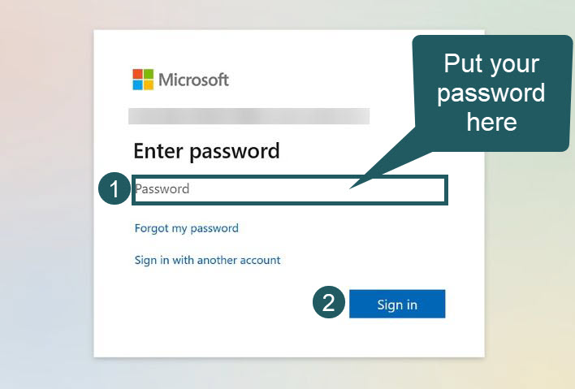
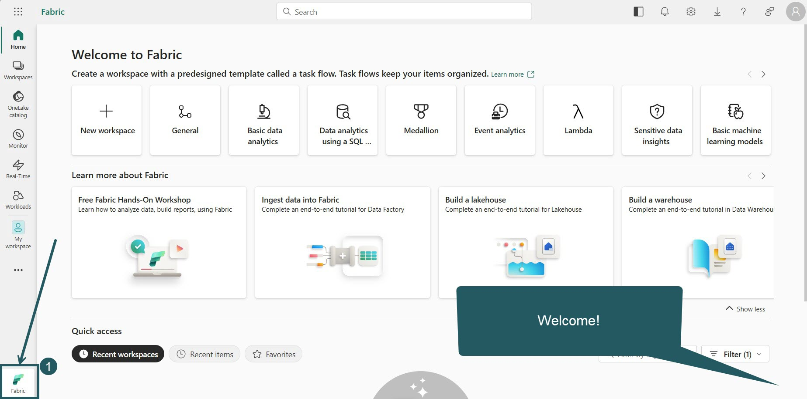
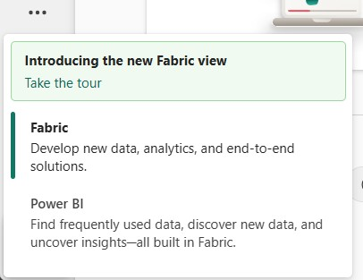
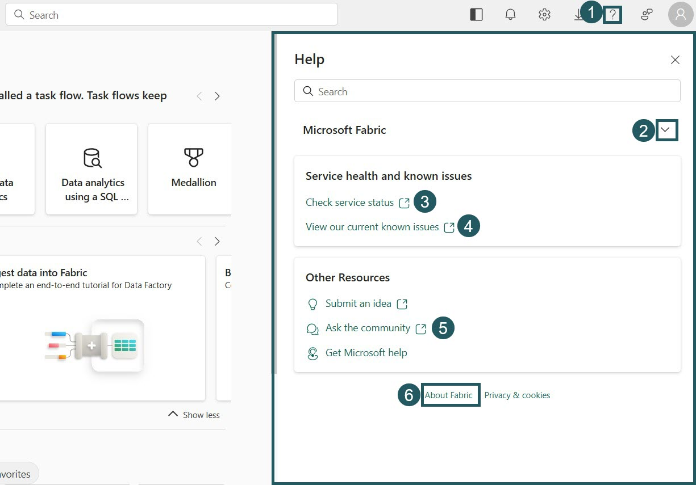
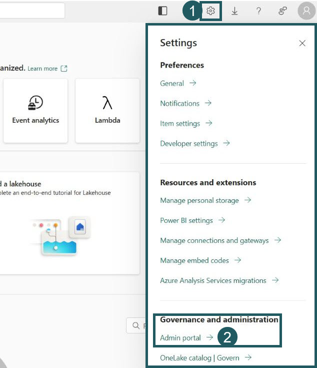
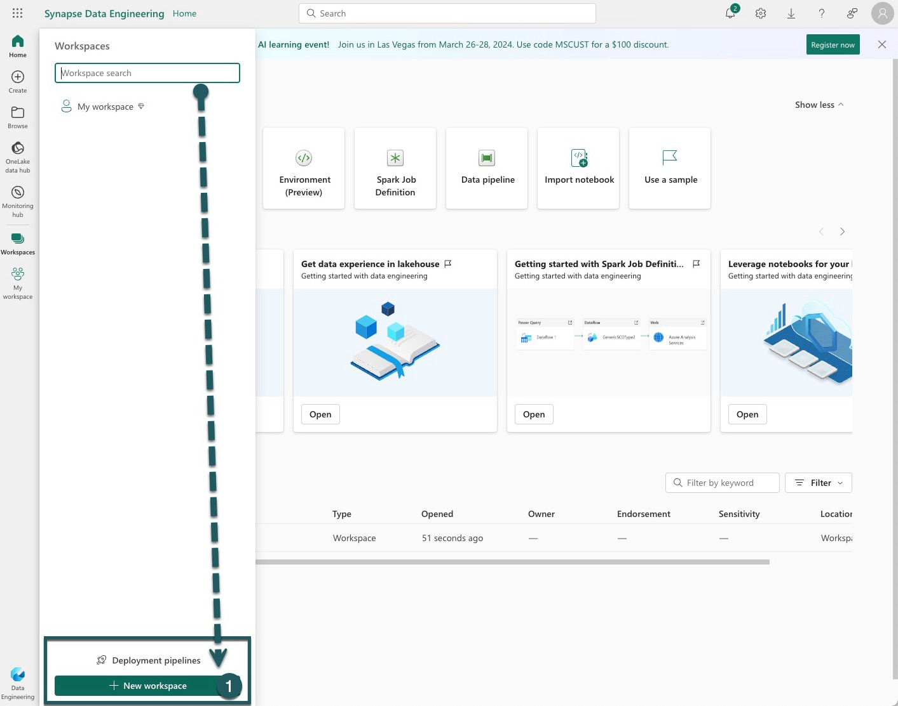
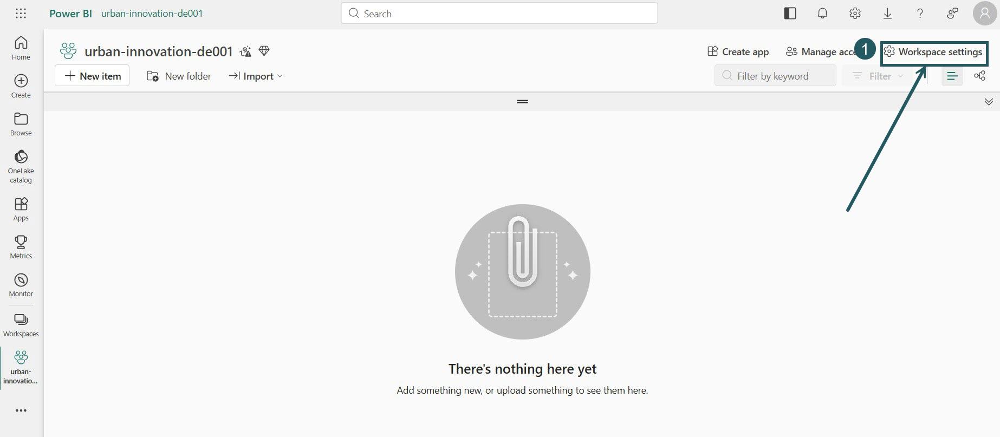
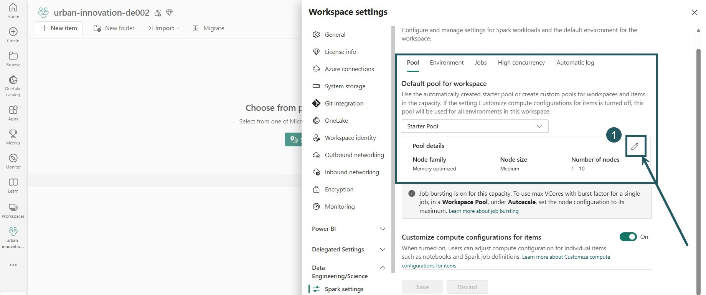
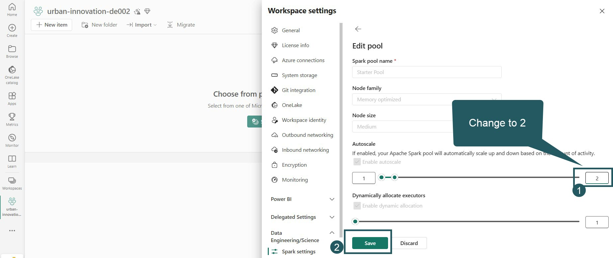

# Start i konfiguracja
> [!NOTE]
> Czas: 30 minut | [Powrót do agendy](./../README.md#agenda) | [Dalej: Ćwiczenie 1](./../exercise-1/exercise-1.md)
   
## 1. Otwórz stronę Microsoft Fabric

> [!TIP]
> Na czas warsztatu zalecamy tryb incognito w przeglądarce. Dzięki temu unikniesz automatycznych przekierowań do tenantów Fabric lub Power BI, z których korzystasz na co dzień. W trybie incognito przeglądarka nie używa twojego domyślnego profilu służbowego, więc łatwiej przejdziesz przez kolejne kroki bez przeszkód.

Wejdź na stronę Microsoft Fabric: https://fabric.microsoft.com/.

## 2. Zaloguj się przydzielonymi danymi
Użyj danych logowania z wizytówki, która leży na twoim stole.

## 3. Wpisz hasło i zaloguj się
Wpisz hasło we wskazanym polu i kliknij przycisk `Sign in`.  

## 4. Zmień hasło
Przy pierwszym logowaniu musisz zmienić hasło. Postępuj zgodnie z instrukcjami na ekranie.

> [!TIP]  
> **Zapisz nowe hasło na odwrocie wizytówki, obok danych logowania. Przyda się, jeśli po restarcie komputera nie będziesz pamiętać hasła.**

## 5. Skonfiguruj uwierzytelnianie wieloskładnikowe (MFA)
Zasady tenanta wymagają skonfigurowania MFA. Możesz to jednak odłożyć, wybierając `Ask Me Later.`  

## 6. Witaj w Microsoft Fabric
Udało ci się zalogować do Microsoft Fabric! Kliknij ikonę Microsoft Fabric w lewym dolnym rogu, aby zobaczyć przełącznik między Fabric i Power BI.  

## 7. Poznaj przełącznik
Sprawdź, jak działa przełącznik między Fabric i Power BI.  

## 8. Poznaj opcje pomocy
Kliknij menu Help & Support w prawym górnym rogu i przejrzyj wszystkie dostępne opcje pomocy.

## 9. Poznaj Settings i Admin portal
Kliknij menu Settings w prawym górnym rogu i przejrzyj opcje. Części ustawień nie zmienisz z powodu ograniczeń dostępu, ale możesz je swobodnie przeglądać.

## 10. Wróć i utwórz workspace
Wróć do ekranu głównego i kliknij `New workspace`, aby zacząć tworzyć nowy workspace.

<!-- ## 11. Otwórz Workspaces
Kliknij ikonę `Workspaces` po lewej stronie ekranu.

## 12. Utwórz nowy workspace
Pojawi się panel boczny z listą wszystkich dostępnych subskrypcji. Postępuj zgodnie z instrukcjami i kliknij `New Workspace.`
 -->

## 11. Nazwij swój workspace
Nadaj nowemu workspace nazwę zgodną z podaną konwencją nazw. Sprawdź nazwę i kliknij `Apply.` Zastosuj konwencję nazw i nadaj nazwę: `urban-innovation-deNNN`, gdzie `NNN` to przydzielony ci numer. Na przykład `urban-innovation-de001` (workspace Estery).

## 12. Workspace utworzony
Gratulacje, twój nowy workspace jest gotowy! W tej przestrzeni będziesz dziś budować i eksperymentować.

## 13. Ustaw maksymalnie 2 węzły w domyślnym Spark pool

Dziś odbywa się równolegle kilka warsztatów. Aby wszystkie przebiegały płynnie, zmień domyślną konfigurację klastra obliczeniowego w swoim workspace Fabric i zmniejsz maksymalną liczbę węzłów do 2.

> [!NOTE]  
>  To zadanie jest kluczowe, bo pozwala rozsądnie gospodarować zasobami i zapewnia płynny przebieg warsztatów wszystkim uczestnikom. Gdy zmniejszasz maksymalną liczbę węzłów do 2, pomagasz ograniczyć obciążenie systemu i poprawiasz komfort pracy wszystkich.

1. **Otwórz Workspace settings**:
   - Upewnij się, że jesteś w widoku właściwego workspace.
   - Otwórz ustawienia workspace tak, jak wskazuje interfejs Fabric.

2. **Zmień konfigurację domyślnego Spark pool**:
   - W lewym panelu nawigacji Workspace settings przejdź do Data Engineering / Data Science, a potem kliknij Spark settings. 
   - Znajdź ustawienie "Default pool for workspace".
   - Kliknij ikonę ołówka, aby edytować ustawienia Spark pool.

3. **Zmień ustawienia autoscale i zapisz zmiany**:
   - W konfiguracji domyślnego Spark pool zmień maksymalną wartość autoscale z 10 na 2. To ogranicza maksymalną liczbę węzłów do 2 i zapobiega nadmiernemu przydziałowi zasobów.
   - Potwierdź i zapisz zmiany w ustawieniach domyślnego Spark pool.

## 14. Pobierz pliki do ćwiczeń
 
[Kliknij tutaj, aby pobrać repozytorium jako Zip](https://github.com/DamianWidera/SQLDayLite2026/archive/refs/heads/main.zip) lub [tutaj, aby pobrać pakiet tar.gz](https://github.com/DamianWidera/SQLDayLite2026/archive/refs/heads/main.tar.gz) na swój komputer. Możesz też sklonować [repozytorium warsztatu na GitHub](https://github.com/DamianWidera/SQLDayLite2026).

---

> [!IMPORTANT]
> Gdy skończysz, przejdź do [następnego ćwiczenia (Ćwiczenie 1)](./../exercise-1/exercise-1.md). Jeśli przed kolejnym ćwiczeniem zostanie ci czas, możesz zająć się [dodatkowymi krokami](../exercise-extra/extra.md).
