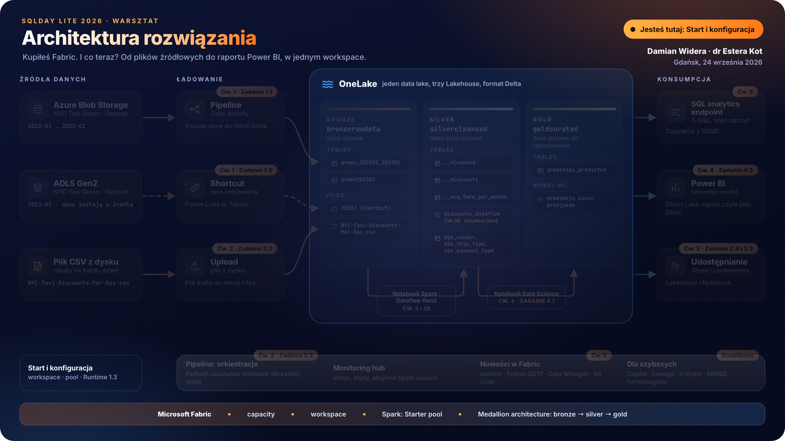

# Start i konfiguracja

> [!NOTE]
> Czas: 30 minut | [Powrót do agendy](./../README.md#agenda) | [Dalej: Ćwiczenie 1](./../exercise-1/exercise-1.md)
>
> Zrzuty ekranu to orientacyjna pomoc, nie wzorzec jeden do jednego. Interfejs Fabric zmienia się co kilka tygodni, więc przyciski mogą być w innym miejscu, nazwy lekko inne, a część zrzutów pochodzi z wcześniejszych edycji warsztatu. Kieruj się tekstem kroku i nazwami w `kodzie`.
   
## 1. Otwórz stronę Microsoft Fabric

> [!TIP]
> Na czas warsztatu zalecamy tryb incognito w przeglądarce. Dzięki temu unikniesz automatycznych przekierowań do tenantów Fabric lub Power BI, z których korzystasz na co dzień. W trybie incognito przeglądarka nie używa twojego domyślnego profilu służbowego, więc łatwiej przejdziesz przez kolejne kroki bez przeszkód.

Wejdź na stronę Microsoft Fabric: https://fabric.microsoft.com/.

## 2. Zaloguj się przydzielonymi danymi
Użyj loginu i hasła, które dostajesz od prowadzących. Login ma postać `fabric.workshop.sepNNN@rocksonearth.onmicrosoft.com`. Numer `NNN` jest przypisany do ciebie na cały dzień.

## 3. Wpisz hasło i zaloguj się
Wpisz hasło we wskazanym polu i kliknij przycisk `Sign in`.  

## 4. Zmień hasło
Przy pierwszym logowaniu musisz zmienić hasło. Postępuj zgodnie z instrukcjami na ekranie.

> [!TIP]  
> **Zapisz nowe hasło obok loginu. Przyda się, jeśli po restarcie komputera nie będziesz pamiętać hasła.**

## 5. Skonfiguruj uwierzytelnianie wieloskładnikowe (MFA)
Zasady tenanta wymagają skonfigurowania MFA. Możesz to jednak odłożyć, wybierając `Ask Me Later.`  

## 6. Witaj w Microsoft Fabric
Udało ci się zalogować do Microsoft Fabric! Kliknij ikonę Microsoft Fabric w lewym dolnym rogu, aby zobaczyć przełącznik między Fabric i Power BI.  

## 7. Poznaj przełącznik
Sprawdź, jak działa przełącznik między Fabric i Power BI.  

## 8. Poznaj opcje pomocy
Kliknij menu Help & Support w prawym górnym rogu i przejrzyj wszystkie dostępne opcje pomocy.

## 9. Poznaj Settings i Admin portal
Kliknij menu Settings w prawym górnym rogu i przejrzyj opcje. Części ustawień nie zmienisz z powodu ograniczeń dostępu, ale możesz je swobodnie przeglądać.

## 10. Otwórz swój workspace
Twój workspace już istnieje. Nazywa się `Fabric Workshop September NNN`, gdzie `NNN` to numer z twojego loginu. Login `fabric.workshop.sep007` ma workspace `Fabric Workshop September 007`.

Kliknij `Workspaces` w lewym menu i wybierz swój workspace z listy. Jeśli lista jest pusta, poczekaj chwilę i odśwież stronę. Uprawnienia do workspace mogą pojawić się z opóźnieniem.

## 11. Dzielisz capacity z innymi
Każdy workspace jest przypisany do jednej z trzech capacity: `fabsep01`, `fabsep02` albo `fabsep03`. Około dziesięciu osób dzieli jedną capacity. Dlatego dwa kolejne kroki są ważne dla wszystkich przy twoim stole, nie tylko dla ciebie.

## 12. Nie twórz nowych workspace
Wszystkie ćwiczenia robisz w swoim workspace. Nie twórz drugiego, bo każdy nowy workspace na wspólnej capacity zabiera zasoby innym.

## 13. Sprawdź Spark pool i Runtime

Około dziesięciu osób dzieli z tobą jedną capacity. Aby wszystkim starczyło zasobów, domyślny Spark pool w twoim workspace ma mieć maksymalnie 2 węzły, a runtime ma być ustawiony na 1.3. Prowadzący ustawili to przed warsztatem. Sprawdź, czy ustawienia są na miejscu. Jeśli nie, ustaw je według kroków poniżej.

> [!NOTE]  
>  To zadanie jest kluczowe, bo pozwala rozsądnie gospodarować zasobami i zapewnia płynny przebieg warsztatów wszystkim uczestnikom. Gdy zmniejszasz maksymalną liczbę węzłów do 2, pomagasz ograniczyć obciążenie systemu i poprawiasz komfort pracy wszystkich.

1. **Otwórz Workspace settings**:
   - Upewnij się, że jesteś w widoku właściwego workspace.
   - Otwórz ustawienia workspace tak, jak wskazuje interfejs Fabric.

2. **Sprawdź konfigurację domyślnego Spark pool**:
   - W lewym panelu nawigacji Workspace settings przejdź do Data Engineering / Data Science, a potem kliknij Spark settings. 
   - Znajdź ustawienie "Default pool for workspace".
   - Kliknij ikonę ołówka, aby edytować ustawienia Spark pool.

3. **Sprawdź ustawienia autoscale**:
   - W konfiguracji domyślnego Spark pool maksymalna wartość autoscale ma wynosić 2. Jeśli widzisz 10, zmień ją na 2. To ogranicza maksymalną liczbę węzłów do 2 i zapobiega nadmiernemu przydziałowi zasobów.
   - Potwierdź i zapisz zmiany w ustawieniach domyślnego Spark pool.

4. **Sprawdź Runtime 1.3**:
   - W tym samym oknie Spark settings otwórz kartę `Environment`.
   - Na liście `Runtime version` ma być `1.3 (Spark 3.5, Delta 3.2)`. Jeśli jest inna wersja, wybierz 1.3 i kliknij `Save`.

> [!NOTE]
> Nie widzisz opcji Spark settings albo nie możesz ich zmienić? Znaczy to, że nie masz roli Admin w workspace. Zgłoś to prowadzącym.

> [!IMPORTANT]
> Notebooki tego warsztatu są przygotowane dla Runtime 1.3. Microsoft zapowiedział, że pod koniec września 2026 roku domyślną wersją w nowych workspace zostanie Runtime 2.0 (Spark 4.1). Dlatego sprawdzamy wersję ręcznie i nie polegamy na wartości domyślnej.

## 14. Pobierz pliki do ćwiczeń
 
[Kliknij tutaj, aby pobrać repozytorium jako Zip](https://github.com/DamianWidera/SQLDayLite2026/archive/refs/heads/main.zip) lub [tutaj, aby pobrać pakiet tar.gz](https://github.com/DamianWidera/SQLDayLite2026/archive/refs/heads/main.tar.gz) na swój komputer. Możesz też sklonować [repozytorium warsztatu na GitHub](https://github.com/DamianWidera/SQLDayLite2026).

Po rozpakowaniu będziesz potrzebować dokładnie trzech plików. Możesz je też pobrać pojedynczo:

| Plik | Gdzie używany | Link bezpośredni |
| :- | :- | :- |
| `notebook-2.ipynb` | Zadanie 2.3 | https://raw.githubusercontent.com/DamianWidera/SQLDayLite2026/main/exercise-2/notebook-2.ipynb |
| `Exercise 4 - Consume Data using Data Science.ipynb` | Zadanie 4.1 | https://raw.githubusercontent.com/DamianWidera/SQLDayLite2026/main/exercise-4/Exercise%204%20-%20Consume%20Data%20using%20Data%20Science.ipynb |
| `NYC-Taxi-Discounts-Per-Day.csv` | Zadanie 2.2 | https://raw.githubusercontent.com/DamianWidera/SQLDayLite2026/main/exercise-2/NYC-Taxi-Discounts-Per-Day.csv |

Pozostałych plików z folderu `exercise-2` (`notebook-2.1.ipynb`, `bronze2silver.ipynb`, `SilverDimsCreation.ipynb`, `Calendar.pqt`) nie importuj, to materiały prowadzących.

---

> [!IMPORTANT]
> Gdy skończysz, przejdź do [następnego ćwiczenia (Ćwiczenie 1)](./../exercise-1/exercise-1.md). Jeśli przed kolejnym ćwiczeniem zostanie ci czas, możesz zająć się [dodatkowymi krokami](../exercise-extra/extra.md).
