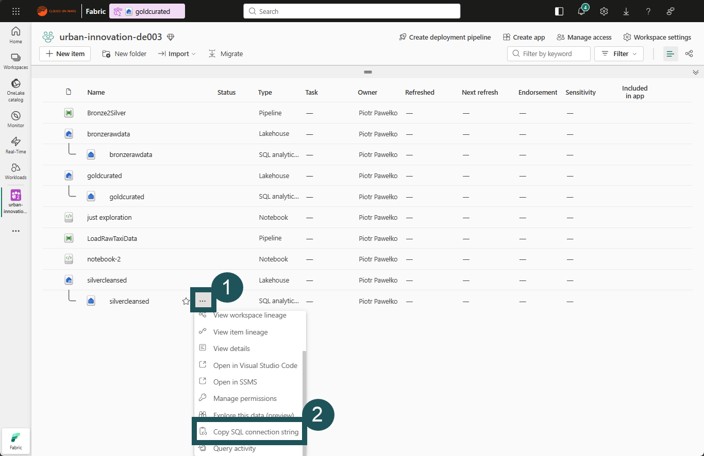
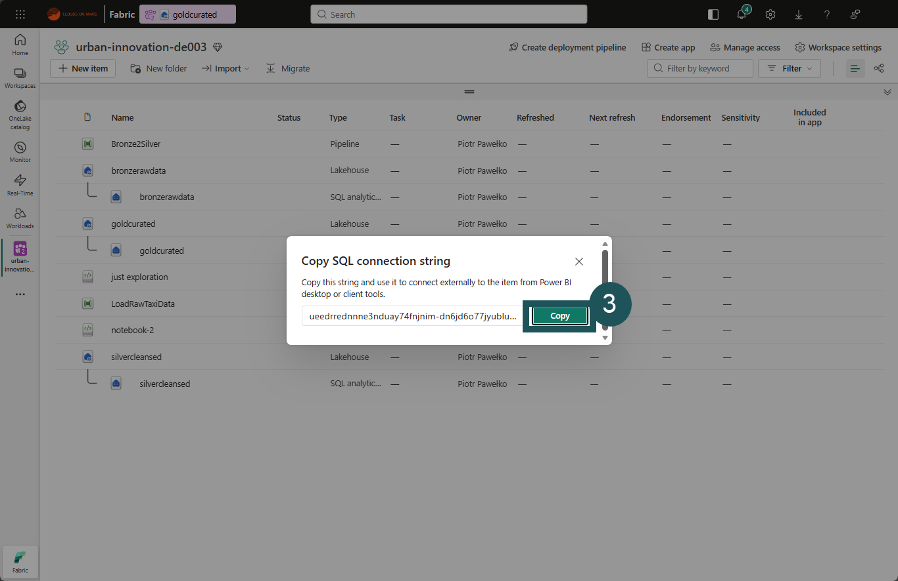
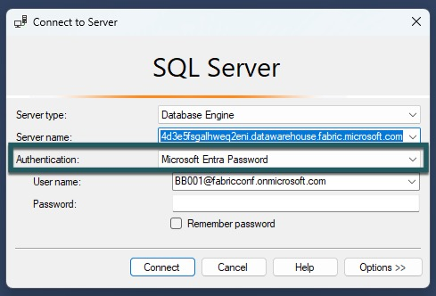
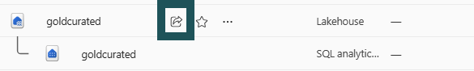
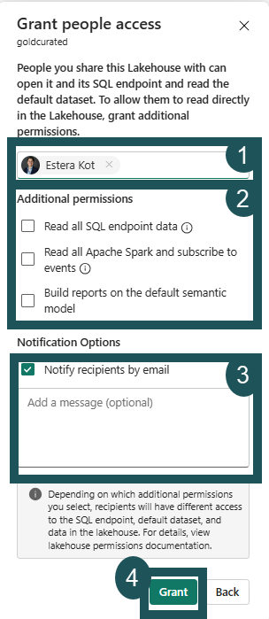
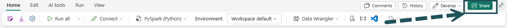
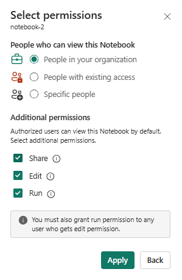
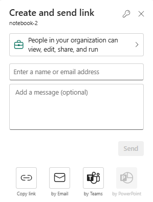
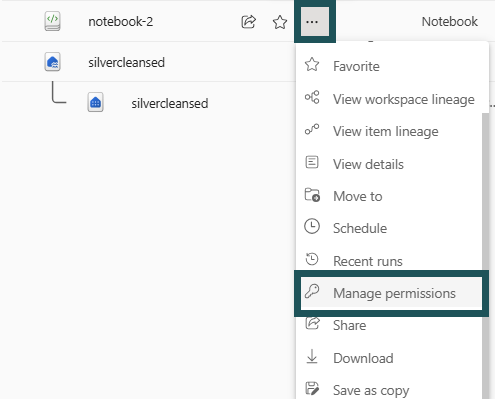

# Ćwiczenie 3 - SQL analytics endpoint, SSMS, udostępnianie i uprawnienia

> [!NOTE]
> Czas: 30 minut
> 
> [Powrót do agendy](./../README.md#agenda) | [Wstecz: Ćwiczenie 2](./../exercise-2/exercise-2.md) | [Dalej: Ćwiczenie 4](./../exercise-4/exercise-4.md)
> #### Lista zadań:
> * [Zadanie 3.1 Pobierz ciąg połączenia dla SQL analytics endpoint w Lakehouse](#zadanie-31-pobierz-ciąg-połączenia-dla-sql-analytics-endpoint-w-lakehouse)
> * [Zadanie 3.2 Połącz się z Fabric SQL Endpoint w SQL Server Management Studio (SSMS)](#zadanie-32-połącz-się-z-fabric-sql-endpoint-w-sql-server-management-studio-ssms)
> * [Zadanie 3.3 Uruchom zapytania T-SQL na tabelach Delta w Lakehouse](#zadanie-33-uruchom-zapytania-t-sql-na-tabelach-delta-w-lakehouse)
> * [Zadanie 3.4 Udostępnij Lakehouse](#zadanie-34-udostępnij-lakehouse)
> * [Zadanie 3.5 Udostępnij Notebook do współpracy](#zadanie-35-udostępnij-notebook-do-współpracy)


**SQL analytics endpoint** w Lakehouse Fabric pozwala analizować dane w tabelach Delta w Lakehouse za pomocą języka T-SQL. Możesz w nim zapisywać funkcje, tworzyć widoki i stosować zabezpieczenia SQL.

Gdy udostępniasz Lakehouse, użytkownicy automatycznie dostają uprawnienie Read. Obejmuje ono sam Lakehouse, powiązany SQL endpoint i domyślny semantic model. Oprócz tego standardowego dostępu użytkownicy mogą dostać także:

-   uprawnienie **ReadData** do SQL endpoint, które daje dostęp do danych bez wymuszania zasad SQL,
-   uprawnienie **ReadAll** do Lakehouse, które daje pełny dostęp do danych przez Apache Spark,
-   uprawnienie **Build** do domyślnego semantic model, które pozwala tworzyć raporty Power BI na podstawie tego modelu.
  
---

# Zadanie 3.1 Pobierz ciąg połączenia dla SQL analytics endpoint w Lakehouse

Cel: pobrać ciąg połączenia SQL dla SQL analytics endpoint twojego Lakehouse. Bez niego nie połączysz się z danymi i nie uruchomisz zapytań w narzędziach opartych na SQL.

1. **Otwórz SQL analytics endpoint**:
   - Przejdź do swojego workspace i znajdź SQL analytics endpoint swojego Lakehouse.
   - Kliknij `More options` (zwykle ikona trzech kropek lub wielokropka) przy SQL analytics endpoint.

2. **Skopiuj ciąg połączenia SQL**:
   - Z dostępnych opcji wybierz `Copy SQL connection string`.
   - Ciąg połączenia trafia do schowka. Masz już wszystko, czego potrzebujesz do nawiązania połączenia SQL.
     
     

3. **Użyj ciągu połączenia**:
   - Ciąg połączenia jest już w schowku, więc możesz połączyć się z SQL analytics endpoint swojego Lakehouse.
   - Otwórz wybrane narzędzie do baz danych, na przykład SQL Server Management Studio (SSMS) lub Azure Data Studio.
   - Otwórz okno nowego połączenia, wklej ciąg połączenia w odpowiednie pole i postępuj zgodnie z instrukcjami, aby nawiązać połączenie.

Chroń ciąg połączenia, bo daje on dostęp do twoich danych w Lakehouse. Nie udostępniaj go publicznie i nie przechowuj w niezabezpieczonych miejscach. Jeśli masz problem ze skopiowaniem lub użyciem ciągu połączenia, sprawdź ustawienia i uprawnienia w workspace z Lakehouse albo zajrzyj do dokumentacji.

---

# Zadanie 3.2 Połącz się z Fabric SQL Endpoint w SQL Server Management Studio (SSMS)
> [!TIP]
> Jeśli interesuje cię lineage i połączenie przez Azure Data Studio, [przejdź do tego dodatkowego ćwiczenia](../exercise-extra/extra.md#lineage).
 
Cel tego zadania: połączyć się z Fabric SQL Endpoint w SQL Server Management Studio (SSMS), aby uruchamiać zapytania i zarządzać danymi bezpośrednio z SSMS. [Pobierz najnowszą ogólnie dostępną (GA) wersję SQL Server Management Studio (SSMS) 20.0 (485 MB)](https://aka.ms/ssmsfullsetup)

1. **Otwórz SQL Server Management Studio**:
   - Uruchom SSMS na swoim komputerze. Po otwarciu aplikacji powinno automatycznie pojawić się okno `Connect to Server`. Jeśli SSMS jest już otwarty, ale nie masz połączenia, przejdź do Object Explorer, kliknij `Connect`, a potem wybierz `Database Engine`.

2. **Wpisz dane serwera**:
   - W polu `Server name` w oknie połączenia wklej skopiowany wcześniej ciąg połączenia SQL. Ten ciąg powinien odpowiadać twojemu Fabric SQL Endpoint.

3. **Uwierzytelnianie**:
   - Jako metodę uwierzytelniania wybierz z listy `Microsoft Entra Password`. Zapewnia to bezpieczne połączenie oparte na nowoczesnych metodach uwierzytelniania.

    

4. **Wpisz dane logowania użytkownika**:
   - W oknie uwierzytelniania, które się pojawi, wpisz adres e-mail swojego użytkownika warsztatowego lub swój firmowy adres e-mail. Postępuj zgodnie z instrukcjami, aby przejść uwierzytelnianie wieloskładnikowe.

5. **Przejrzyj Lakehouse**:
   - Po połączeniu panel Object Explorer w SSMS pokaże połączony Lakehouse. Możesz rozwinąć węzeł serwera, aby zobaczyć bazy danych (Lakehouse) oraz przejść przez tabele, widoki i inne obiekty dostępne dla zapytań.

> [!IMPORTANT]
> Chroń informacje poufne, takie jak ciągi połączenia i dane logowania. Upewnij się, że masz właściwe uprawnienia dostępu do danych i do SQL endpoint. Jeśli masz problemy z połączeniem, sprawdź ciąg połączenia i dane uwierzytelniania. Sprawdź też ustawienia sieci i reguły zapory, które mogą blokować połączenie z Fabric SQL Endpoint.

---

# Zadanie 3.3 Uruchom zapytania T-SQL na tabelach Delta w Lakehouse

Uruchom serię zapytań T-SQL na tabelach Delta w Lakehouse. Skup się na analizie danych z tabeli NYC Taxi w bazie danych `silvercleansed`. Te zapytania pomogą ci zrozumieć agregację danych, tworzenie widoków i podstawowe operacje SQL w środowisku Lakehouse.

1. **Policz wiersze w tabeli NYC Taxi**:
   - Uruchom poniższe zapytanie SQL, aby poznać łączną liczbę wierszy w tabeli `green201501_cleansed`:
     ```sql
     SELECT COUNT(*)
     FROM [silvercleansed].[dbo].[green201501_cleansed];
     ```

2. **Oblicz średnią opłatę za przejazd i średni napiwek**:
   - Uruchom poniższe zapytanie, aby obliczyć średnią opłatę za przejazd i średni napiwek w tej samej tabeli:
     ```sql
     SELECT ROUND(AVG([fare_amount]),2) AS [Average Fare], 
     ROUND(AVG([tip_amount]),2) AS [Average Tip] 
     FROM [silvercleansed].[dbo].[green201501_cleansed];
     ```

3. **Zagreguj opłaty według liczby pasażerów**:
   - Użyj poniższego zapytania, aby otrzymać sumę i średnią opłat pogrupowane według liczby pasażerów i posortowane malejąco według średniej opłaty:
     ```sql
     SELECT DISTINCT [passenger_count], 
     ROUND(SUM([fare_amount]),0) as TotalFares,
     ROUND(AVG([fare_amount]),0) as AvgFares
     FROM [silvercleansed].[dbo].[green201501_cleansed]
     GROUP BY [passenger_count]
     ORDER BY AvgFares DESC;
     ```

4. **Porównaj przejazdy z napiwkiem i bez napiwku**:
   - Uruchom to zapytanie, aby porównać liczbę przejazdów, w których dano napiwek, z liczbą przejazdów bez napiwku:
     ```sql
     SELECT tipped, COUNT(*) AS tip_freq FROM (
       SELECT CASE WHEN (tip_amount > 0) THEN 1 ELSE 0 END AS tipped, tip_amount
       FROM [silvercleansed].[dbo].[green201501_cleansed]
       WHERE [lpep_pickup_datetime] BETWEEN '20150101' AND '20151231') tc
     GROUP BY tipped;
     ```

5. **Utwórz widok ze średnią i sumą opłat według liczby pasażerów**:
   - Uruchom poniższe polecenie SQL, aby utworzyć widok na podstawie zapytania SQL z kroku 3:
     ```sql
     CREATE VIEW [dbo].[viGetAverageFares]
     AS 
     SELECT DISTINCT [passenger_count], 
     ROUND(SUM([fare_amount]),0) as TotalFares,
     ROUND(AVG([fare_amount]),0) as AvgFares
     FROM [silvercleansed].[dbo].[green201501_cleansed]
     GROUP BY [passenger_count];
     ```

6. **Uruchom zapytanie na nowym widoku**:
   - Na koniec pobierz dane z nowo utworzonego widoku, aby sprawdzić, czy działa poprawnie:
     ```sql
     SELECT * FROM [silvercleansed].[dbo].[viGetAverageFares];
     ```

> [!IMPORTANT]
> Upewnij się, że masz uprawnienia do uruchamiania tych zapytań i tworzenia widoków w Lakehouse. Zwróć uwagę na składnię i strukturę bazy danych, aby wyniki były poprawne. Zapisuj ciekawe obserwacje i anomalie, które zauważysz podczas analizy. Przydadzą się do dalszego badania lub dyskusji.

---

# Zadanie 3.4 Udostępnij Lakehouse

Dowiedz się, jak udostępnić Lakehouse członkom zespołu lub interesariuszom w swoim workspace i nadać im właściwy poziom dostępu.

1. **Przejdź do swojego Lakehouse**:
   - W swoim workspace znajdź Lakehouse, który chcesz udostępnić.
   - Kliknij przycisk **Share** obok nazwy Lakehouse.
     

2. **Skonfiguruj ustawienia udostępniania**:
   - W oknie udostępniania wpisz imię i nazwisko lub adres e-mail osób, którym chcesz udostępnić Lakehouse.
   - Nadaj właściwe uprawnienia, zaznaczając odpowiednie pola. Domyślnie udostępnienie Lakehouse daje dostęp do Lakehouse, powiązanego SQL endpoint i domyślnego semantic model.
   
   

3. **Ustawienia powiadomień**:
   - Jeśli chcesz powiadomić odbiorców e-mailem, zaznacz opcję **`Notify recipients by mail`**.
   - Możesz dodać wiadomość z kontekstem lub instrukcjami dla odbiorców.

4. **Zakończ udostępnianie**:
   - Gdy skonfigurujesz ustawienia udostępniania i powiadomień, kliknij **Grant**, aby udostępnić Lakehouse.

> [!IMPORTANT]
> Udostępniaj Lakehouse tylko osobom, które potrzebują dostępu, i nadawaj im uprawnienia odpowiednie do ich potrzeb i ról. Gdy udostępniasz zasoby Lakehouse, stosuj zasady swojej organizacji dotyczące udostępniania danych i prywatności. Zapisuj, kto ma dostęp do Lakehouse. Przyda się to później i ułatwi spełnienie wymogów bezpieczeństwa.

---

# Zadanie 3.5 Udostępnij Notebook do współpracy

Dowiedz się, jak udostępnić Notebook członkom zespołu w swoim workspace i umożliwić współpracę z określonymi uprawnieniami.

1. **Otwórz Notebook**:
   - Przejdź do Notebooka, który chcesz udostępnić.
   - Kliknij przycisk **Share** na pasku narzędzi Notebooka.
   
     
2. **Ustaw uprawnienia**:
   - W ustawieniach udostępniania wybierz kategorię **people who can view this notebook**.
   - Nadaj właściwe uprawnienia, wybierając spośród **Share**, **Edit** i **Run**. Od tego zależy, co odbiorcy będą mogli zrobić z Notebookiem.

     

3. **Udostępnij Notebook**:
   - Po ustawieniu uprawnień kliknij **Apply**.
   - Potem możesz wysłać Notebook bezpośrednio do członków zespołu albo skopiować link i rozesłać go samodzielnie. Odbiorcy dostaną dostęp do Notebooka zgodnie z ustawionymi uprawnieniami.

     

4. **Zarządzaj uprawnieniami do Notebooka**:
   - Aby ustawić dodatkowe uprawnienia lub zmienić dostęp, przejdź do listy elementów w workspace.
   - Kliknij **More options** obok swojego Notebooka i wybierz **Manage permissions**. Tutaj możesz zmienić, kto ma dostęp i na jakim poziomie.

     


> [!NOTE]
> Gdy udostępniasz Notebook, pamiętaj o danych i informacjach, które zawiera. Dostęp powinny dostać tylko właściwe osoby. Sprawdź zasady swojej organizacji dotyczące udostępniania danych i współpracy, aby spełnić standardy bezpieczeństwa i prywatności. Zapisuj problemy i trudności, które napotkasz podczas udostępniania. Przydadzą się później albo wtedy, gdy będziesz szukać pomocy.

---


> [!IMPORTANT]
> Gdy skończysz, przejdź do [następnego ćwiczenia (Ćwiczenie 4)](./../exercise-4/exercise-4.md). Jeśli przed kolejnym ćwiczeniem zostanie ci czas, możesz zająć się [dodatkowymi krokami](../exercise-extra/extra.md).
