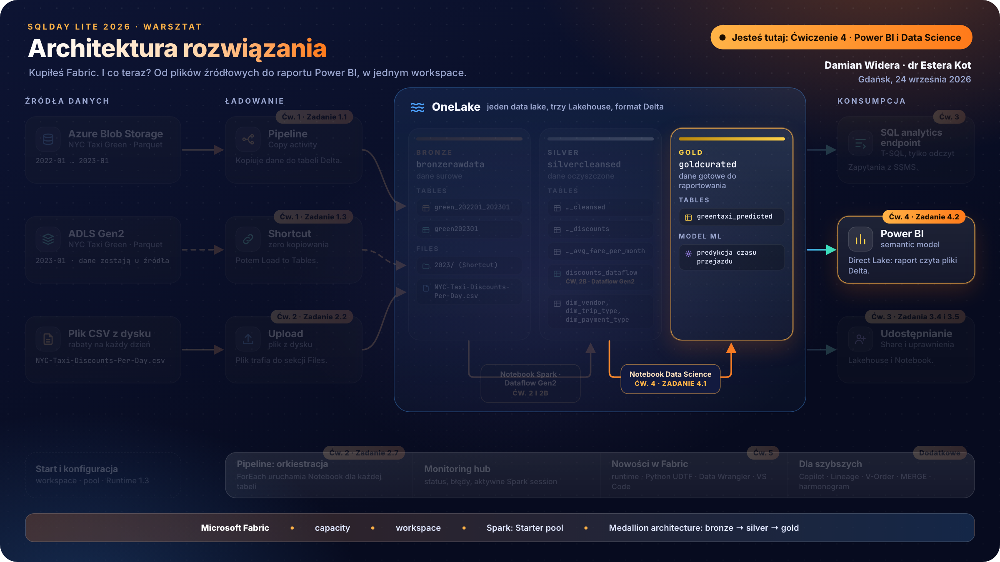
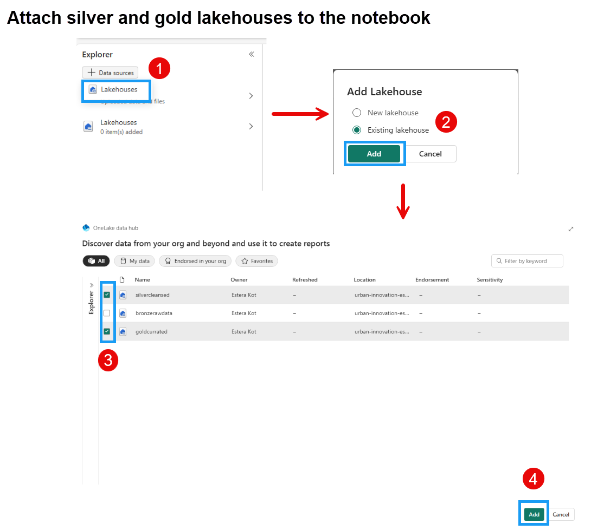
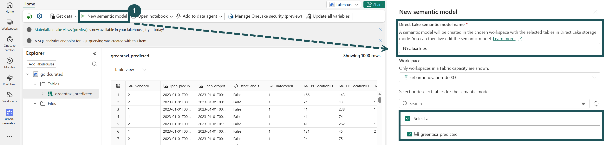
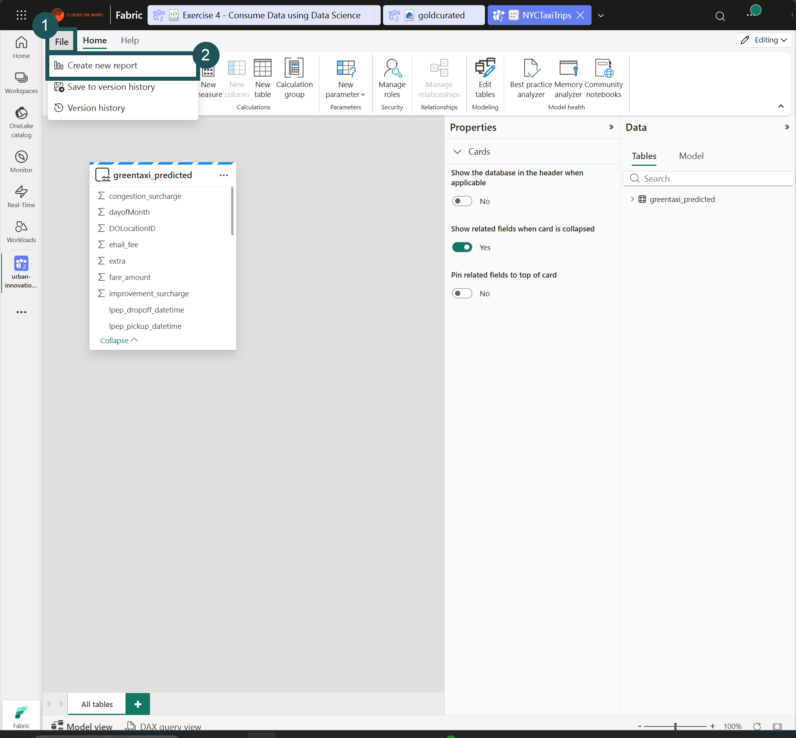
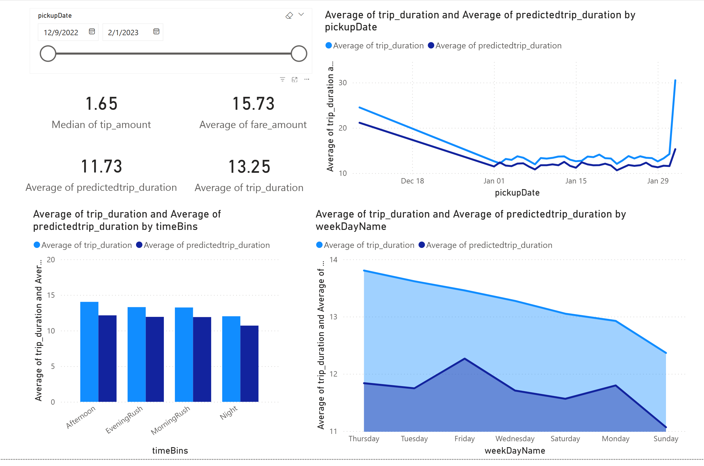
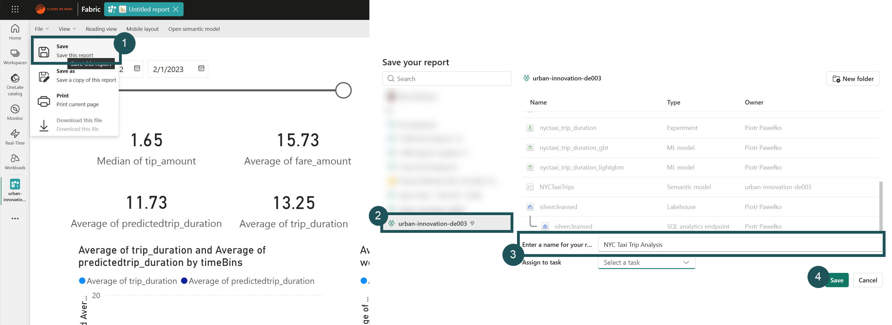
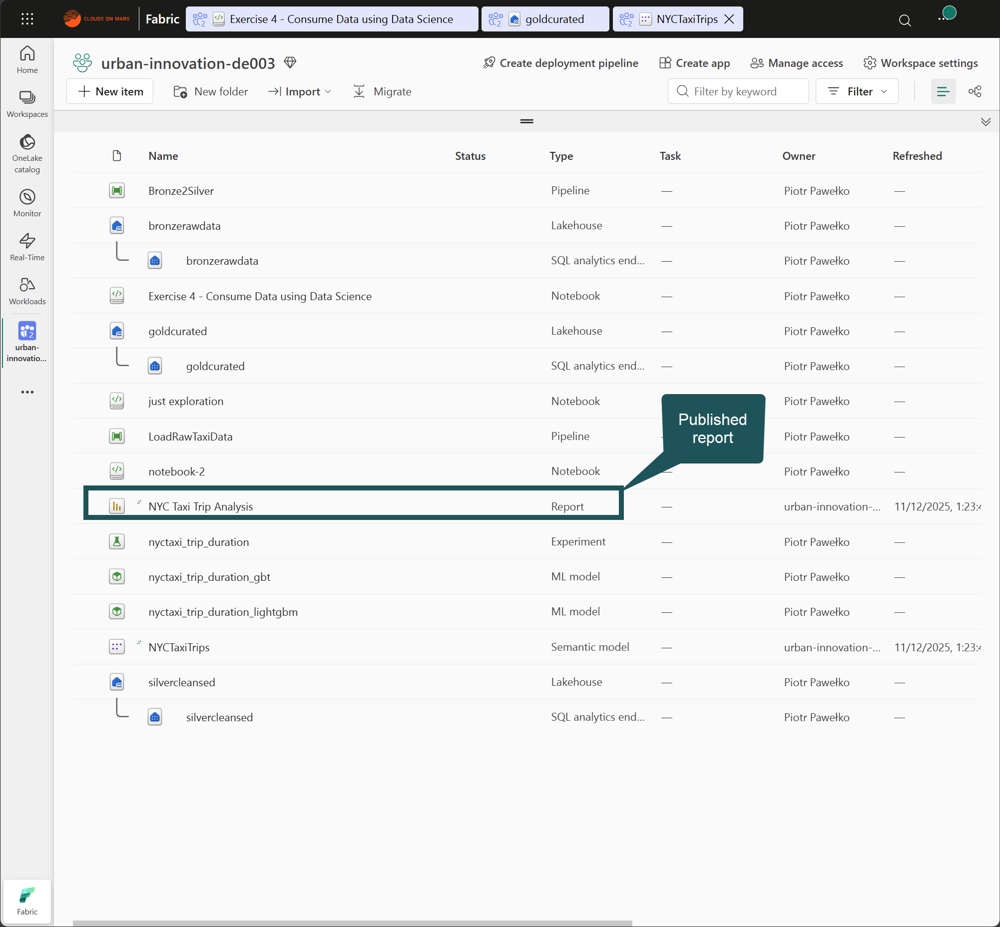

# Ćwiczenie 4 - Semantic model i raport Power BI

> [!NOTE]
> Czas: 80 minut
>
> Samo trenowanie modelu w Zadaniu 4.1 może zająć 10-20 minut na współdzielonej capacity. Uruchom je wcześnie i w tym czasie przeczytaj kroki Zadania 4.2.
>
> Zrzuty ekranu to orientacyjna pomoc, nie wzorzec jeden do jednego. Interfejs Fabric zmienia się co kilka tygodni, więc przyciski mogą być w innym miejscu, nazwy lekko inne, a część zrzutów pochodzi z wcześniejszych edycji warsztatu. Kieruj się tekstem kroku i nazwami w `kodzie`.
> 
> [Powrót do agendy](./../README.md#agenda) | [Wstecz: Ćwiczenie 3](./../exercise-3/exercise-3.md) | [Dalej: Ćwiczenie 5](./../exercise-5/exercise-5.md)
> #### Lista zadań:
> * [Zadanie 4.1 Przewidź czas przejazdu za pomocą Data Science w Fabric Lakehouse](#zadanie-41-przewidź-czas-przejazdu-za-pomocą-data-science-w-fabric-lakehouse)
> * [Zadanie 4.2 Zbadaj i zwizualizuj dane o przejazdach taksówek w Power BI i Direct Lake](#zadanie-42-zbadaj-i-zwizualizuj-dane-o-przejazdach-taksówek-w-power-bi-i-direct-lake)
> * [Zadanie 4.3 Opublikuj i udostępnij raport Power BI](#zadanie-43-opublikuj-i-udostępnij-raport-power-bi)

# Kontekst

Na tabelach w twoim Lakehouse zbudujesz semantic model: relacyjny model danych, w którym zdefiniujesz własne miary, hierarchie i agregacje. Fabric nie tworzy już domyślnego semantic model razem z Lakehouse, utworzysz go sam w Zadaniu 4.2 przyciskiem `New semantic model`. Potem użyjesz go jako źródła raportu Power BI, w którym zwizualizujesz i przeanalizujesz dane.

Dzięki funkcji **Direct Lake** utworzysz zestawy danych Power BI bezpośrednio na danych przechowywanych w Lakehouse. Direct Lake przyspiesza zapytania na dużych wolumenach danych i dobrze współpracuje z obciążeniami Lakehouse, które odczytują i zapisują pliki Parquet. Gdy połączysz wizualizację danych w Power BI z centralnym magazynem danych i tabelarycznym schema, które daje Lakehouse, zbudujesz kompletne rozwiązanie analityczne na jednej platformie.

**Fabric pozwala zwizualizować dane bez opuszczania Lakehouse.** Przydaje się to szczególnie wtedy, gdy eksplorujesz dane w trakcie pracy i chcesz sprawdzić, czy masz wszystkie dane i transformacje potrzebne do analizy.

W SQL analytics endpoint Lakehouse użyj przycisku `Explore this data` (albo `Visualize results` przy wyniku zapytania), aby zobaczyć wyniki pojedynczego zapytania w Power BI.

Aby zbudować pełny raport, użyj przycisku `New semantic model` na wstążce Lakehouse, a potem `New report` na utworzonym semantic model. Raport zbudujesz i zapiszesz w przeglądarce, bez Power BI Desktop.

---

# Direct Lake a DirectQuery w Power BI

Power BI jest natywnie zintegrowany z całym Fabric. Ta integracja daje unikalny tryb dostępu do danych z Lakehouse, nazwany Direct Lake, który zapewnia najwyższą wydajność zapytań i raportów. Tryb Direct Lake to przełomowa funkcja silnika, która pozwala analizować bardzo duże zestawy danych w Power BI. Technologia opiera się na ładowaniu plików w formacie Parquet bezpośrednio z data lake. Nie trzeba odpytywać Data Warehouse ani punktu końcowego Lakehouse, nie trzeba też importować ani duplikować danych w zestawie danych Power BI. Direct Lake to szybka ścieżka, którą dane trafiają z data lake prosto do silnika Power BI, gotowe do analizy.

W tradycyjnym trybie DirectQuery silnik Power BI przy każdym zapytaniu pobiera dane bezpośrednio ze źródła danych, więc wydajność zapytań zależy od tego, jak szybko źródło zwraca dane. Ta metoda nie wymaga kopiowania danych, a każda zmiana w źródle jest od razu widoczna w wynikach zapytań. W Import mode wydajność jest lepsza, ponieważ dane są od razu dostępne w pamięci i nie trzeba za każdym razem odpytywać źródła danych. Silnik Power BI musi jednak najpierw skopiować dane do zestawu danych podczas odświeżania. Zmiany w źródle są widoczne dopiero po kolejnym odświeżeniu danych.

Tryb Direct Lake usuwa konieczność importu, bo ładuje pliki danych bezpośrednio do pamięci. Nie ma tu jawnego procesu importu, więc zmiany w źródle można wychwytywać na bieżąco. Tryb łączy w ten sposób zalety DirectQuery i Import mode, a omija ich wady. Dlatego Direct Lake to najlepszy wybór do analizy bardzo dużych zestawów danych i zestawów danych, które często zmieniają się w źródle.

---

# Zadanie 4.1 Przewidź czas przejazdu za pomocą Data Science w Fabric Lakehouse

W tym ćwiczeniu wcielisz się w rolę data scientist, który ma zbadać, oczyścić i przekształcić zbiór danych o przejazdach taksówek. Zbudujesz model uczenia maszynowego, który przewiduje czas trwania przejazdów taksówek. Użyjesz zbioru danych greencab o nowojorskich taksówkach z okresu od stycznia 2022 do stycznia 2023 roku, który zawiera m.in. czas rozpoczęcia i zakończenia przejazdu, lokalizacje, opłaty i liczbę pasażerów. Potem zastosujesz model, aby wygenerować predykcje dla danych greencab z 2023 roku, i zapiszesz je w Lakehouse.

1. **Pobierz Notebook z ćwiczeniem**:
   - Pobierz na swój komputer przygotowany Notebook Jupyter, [Exercise 4 - Consume Data using Data Science](Exercise%204%20-%20Consume%20Data%20using%20Data%20Science.ipynb). Ten Notebook zawiera kroki, które wykonasz w tym zadaniu. [Na tym zrzucie ekranu widać, jak to zrobić](../screenshots/extra/new/download-notebook-2.jpg).

2. **Zaimportuj Notebook do workspace w Fabric**:
   - Przejdź do swojego workspace w Fabric, w sekcji Data Engineering albo Data Science.
   - Zaimportuj pobrany Notebook zgodnie z instrukcją w [Ćwiczeniu 2 - import Notebooków](../exercise-2/exercise-2.md#231-zaimportuj-notebook). W tym celu wybierz opcję importu istniejących Notebooków i wskaż pobrany plik .ipynb na swoim komputerze.

3. **Podłącz oba Lakehouse do Notebooka**:
   - Otwórz zaimportowany Notebook. W panelu po lewej kliknij `Add data items` i dodaj `silvercleansed` oraz `goldcurated` (utworzony w [Zadaniu 2.9](../exercise-2/exercise-2.md#zadanie-29-utwórz-lakehouse-gold-wymagany-w-ćwiczeniu-4)).
   - Bez podłączonych obu Lakehouse pierwsza komórka z kodem zakończy się błędem `TABLE_OR_VIEW_NOT_FOUND`.
     

4. **Wykonaj instrukcje z Notebooka**:
   - Po podłączeniu Lakehouse wróć na górę Notebooka.
   - Wykonaj szczegółowe kroki opisane w Notebooku. Przeprowadzą cię przez:
     - Eksplorację i czyszczenie danych: poznaj strukturę zbioru danych, usuń niespójności i przygotuj dane do modelowania.
     - Inżynierię cech: utwórz nowe cechy z istniejących danych, aby poprawić moc predykcyjną modelu uczenia maszynowego.
     - Trenowanie modelu: wybierz model uczenia maszynowego i wytrenuj go na przygotowanym zbiorze danych.
     - Ocenę: oceń jakość modelu na podstawie standardowych metryk.

4. **Ukończ ćwiczenie**:
   - Przejdź przez każdy krok w Notebooku, uruchamiaj komórki z kodem i notuj wnioski oraz obserwacje.
   - Pamiętaj, aby zapisywać postępy w trakcie pracy z Notebookiem.

---

# Zadanie 4.2 Zbadaj i zwizualizuj dane o przejazdach taksówek w Power BI i Direct Lake

W tym ćwiczeniu zbadasz i zwizualizujesz dane o przejazdach taksówek razem z przewidywanym czasem przejazdu z modelu uczenia maszynowego, który powstał w Zadaniu 4.1. Użyjesz funkcji Direct Lake w Microsoft Fabric do bezpośredniego połączenia z danymi i utworzysz raport Power BI do analizy danych.

### Kroki do wykonania

1. **Otwórz artefakt Lakehouse**:
   - Przejdź do artefaktu Lakehouse "goldcurated" w swoim workspace, którego używasz od poprzednich ćwiczeń.
   - Otwórz interfejs Lakehouse, aby zacząć pracę z danymi.

2. **Utwórz nowy semantic model**:
   - Kliknij przycisk "New semantic model" na górnej wstążce.
   - W oknie dialogowym nazwij semantic model (np. NYCTaxiTrips) i wybierz **greentaxi_predicted** jako źródło danych. Potwierdź, aby utworzyć semantic model połączony z danymi predykcji.
     

3. **Wygeneruj nowy raport Power BI**:
   - W interfejsie semantic model kliknij przycisk ***New report*** na górnej wstążce. W nowej karcie przeglądarki otworzy się strona tworzenia raportu Power BI.
   
     

> [!IMPORTANT]  
> Teraz możesz tworzyć dowolne wizualizacje według własnych potrzeb i szukać wniosków w zbiorze danych z predykcjami albo wykonać kroki opisane poniżej.

#### Przykładowe wizualizacje do analizy predictedtrip_duration

1. Utwórz wizualizację Slicer dla pickupDate.
    - Wybierz opcję slicer w panelu Visualizations, zaznacz ***pickupDate*** w panelu Data i upuść je na pole utworzonej wizualizacji slicer, czyli suwaka dat.

2. Zwizualizuj średnie trip_duration i predictedtrip_duration według timeBins na clustered column chart.
    - Dodaj clustered column chart, dodaj ***timeBins*** do X-axis, ***trip_duration*** i ***predictedtrip_duration*** do Y-axis i zmień metodę agregacji na Average.

3. Zwizualizuj średnie trip_duration i predictedtrip_duration według weekDayName.
    - Dodaj wizualizację area chart, dodaj ***weekDayName*** do X-axis, ***trip_duration*** do Y-axis i ***predictedtrip_duration*** do secondary Y-axis. Przełącz metodę agregacji na Average dla obu osi Y.

4. Zwizualizuj średnie trip_duration i predictedtrip_duration według pickupDate na line chart.
    - Dodaj wizualizację line chart, dodaj ***pickupDate*** do X-axis, ***trip_duration*** i ***predictedtrip_duration*** do Y-axis i przełącz metodę agregacji na Average dla obu pól.

5. Utwórz wizualizacje Card, aby zobaczyć kluczowe metryki w jednym miejscu.
   - Dodaj wizualizację Card, przeciągnij ***tip_amount*** do fields i przełącz metodę agregacji na median.
   - Dodaj drugą wizualizację Card, przeciągnij ***fare_amount*** do fields i przełącz metodę agregacji na average.
   - Dodaj trzecią wizualizację Card, przeciągnij ***predictedtrip_duration*** do fields i przełącz metodę agregacji na average. 
   - Dodaj czwartą wizualizację Card, przeciągnij ***trip_duration*** do fields i przełącz metodę agregacji na average.

  Teraz możesz zmienić układ i wygląd wizualizacji według własnych potrzeb. Raport jest gotowy do publikacji.

  

> [!TIP]
> Pamiętaj, aby zapisać i opublikować raport. Dzięki temu interesariusze będą mogli go przejrzeć i podejmować na jego podstawie decyzje.

---

# Zadanie 4.3 Opublikuj i udostępnij raport Power BI

W tym zadaniu opublikujesz raport Power BI z poprzedniego zadania w swoim workspace Power BI i udostępnisz go innym użytkownikom w swojej organizacji.

1. **Zapisz raport i nadaj mu nazwę**:
   - W edytorze raportów Power BI przejdź do menu File i wybierz opcję Save albo Save As, aby otworzyć okno zapisu raportu.
   - Wpisz nazwę raportu, na przykład *NYC Taxi Trip Analysis*.
   - W oknie zapisu wybierz swój workspace `Fabric Workshop September NNN` (ten sam numer co twój login). Nie twórz nowego workspace i nie zapisuj raportu w cudzym. Kliknij Save.
     

> Na zrzucie w polu workspace widać workspace prowadzącego. U ciebie ma tam być `Fabric Workshop September NNN`. Na liście prowadzącego widać też model `nyctaxi_trip_duration_gbt`, którego ty nie będziesz mieć, to normalne.

2. **Opublikuj raport**:
   - Po zapisaniu raport Power BI będzie dostępny jako artefakt w wybranym workspace, gotowy do udostępniania i używania.
     

3. **Udostępnij raport**:
   - Otwórz opublikowany raport ze swojego workspace.
   - Kliknij ‘Share’ na górnym pasku nawigacji, aby otworzyć opcje udostępniania.
   - W oknie ‘Send link’ wybierz, czy chcesz skopiować link do udostępniania, czy udostępnić go bezpośrednio przez Outlook, PowerPoint i Teams osobom w swojej organizacji.
   - Ustaw odpowiednie uprawnienia do raportu. Zwykle pozwalasz odbiorcom przeglądać raport i korzystać z niego interaktywnie, bez uprawnień do edycji.

> [!TIP]
> Przed udostępnieniem sprawdź, czy raport jest poprawnie sformatowany i zawiera wszystkie istotne wnioski. Gdy udostępniasz raporty, pamiętaj też o prywatności i bezpieczeństwie danych, zwłaszcza jeśli zawierają informacje wrażliwe. Więcej o opcjach udostępniania i dobrych praktykach znajdziesz w przewodniku Microsoft [Udostępnianie i współpraca](https://learn.microsoft.com/en-us/power-bi/collaborate-share/service-share-dashboards). To zadanie pokaże ci, jak skutecznie rozpowszechniać w organizacji informacje i wnioski z analizy danych.

## Zanim przejdziesz dalej

| ID | Sprawdź | Gdzie |
| :- | :- | :- |
| F6 | tabela `greentaxi_predicted` w Lakehouse `goldcurated` | Lakehouse explorer, sekcja Tables |
| F6a | ML model `nyctaxi_trip_duration_lightgbm` i experiment `nyctaxi_trip_duration` | lista elementów w workspace |
| F7 | semantic model w trybie Direct Lake i raport Power BI | lista elementów w workspace `Fabric Workshop September NNN` |

---

> [!IMPORTANT]
> Po zakończeniu przejdź do [następnego ćwiczenia (Ćwiczenie 5)](./../exercise-5/exercise-5.md). Jeśli przed kolejnym ćwiczeniem zostanie ci czas, możesz wykonać [dodatkowe kroki](../exercise-extra/extra.md).
