# Ćwiczenia dodatkowe

> [!NOTE]
> 
> Powrót do [agendy](./../README.md#agenda) | [Start i konfiguracja](../exercise-0-setup/start.md) | [Ćwiczenie 1](./../exercise-1/exercise-1.md) | [Ćwiczenie 2](./../exercise-2/exercise-2.md) | [Ćwiczenie 3](./../exercise-3/exercise-3.md) | [Ćwiczenie 4](./../exercise-4/exercise-4.md) | [Ćwiczenie 5](./../exercise-5/exercise-5.md)
> #### Lista ćwiczeń dodatkowych:
> * [Copilot w Notebooku](#copilot-w-notebooku)
> * [SQL Analytics Endpoint](#sql-analytics-endpoint)
> * [Połącz się z Fabric SQL Endpoint za pomocą SQL Server Management Studio (SSMS)](#połącz-się-z-fabric-sql-endpoint-za-pomocą-sql-server-management-studio-ssms)
> * [Uruchom zapytania T-SQL na tabelach Delta w Lakehouse](#uruchom-zapytania-t-sql-na-tabelach-delta-w-lakehouse)
> * [Udostępnianie Lakehouse](#udostępnianie-lakehouse)
> * [Udostępnianie Notebooka do współpracy](#udostępnianie-notebooka-do-współpracy)
> * [High concurrency mode w Fabric Spark](#high-concurrency-mode-w-fabric-spark)
> * [Lineage](#lineage)
> * [Wybierz format pliku i typ kompresji docelowych zbiorów danych w Data Factory](#wybierz-format-pliku-i-typ-kompresji-docelowych-zbiorów-danych-w-data-factory)
> *  [Monitoruj uruchomienie Pipeline i sprawdź wynik](#monitoruj-uruchomienie-pipeline-i-sprawdź-wynik)
> *  [Medallion architecture](#medallion-architecture)
> *  [Zaplanuj uruchamianie Notebooka](#zaplanuj-uruchamianie-notebooka-kilka-razy-dziennie)
> *  [Utwórz nowy Spark pool w ustawieniach na poziomie workspace]()
> *  [Zapisane z V-Order?](#sprawdź-v-order)
> *  [Merge](#merge)

---

# Copilot w Notebooku

Copilot dla Data Science i Data Engineering to asystent AI, z którym rozmawiasz na czacie. Pomaga analizować i wizualizować dane. Możesz go pytać o tabele w Lakehouse, Power BI Datasets albo obiekty DataFrame Pandas i Spark w Notebooku. Copilot odpowiada zwykłym językiem albo fragmentami kodu. Potrafi też wygenerować kod dopasowany do twoich danych i do zadania. Na przykład Copilot dla Data Science i Data Engineering wygeneruje kod, który:
* tworzy wykresy 
* filtruje dane 
* stosuje transformacje 
* buduje modele uczenia maszynowego


Przyjrzyj się tabeli `green_202201_202301` w swoim Lakehouse i poszukaj ciekawych obserwacji na temat tego zbioru danych. Zapytaj też, jak obliczyć średnią długość przejazdu i średnią opłatę dla każdego typu płatności.

> [!IMPORTANT]
> Stan na wrzesień 2026 roku: Copilot w Notebooku nie wymaga już instalacji ani uruchamiania komórki startowej. Przycisk `Get started` i komórka instalacyjna z kroków poniżej mogą się nie pojawić. W takim przypadku otwórz panel Copilot i od razu zacznij rozmowę.
> Copilot wymaga płatnej capacity F2 lub większej i nie działa na Fabric trial capacity. Administrator tenanta musi też włączyć Copilot w Admin portal.

## Otwórz panel Copilot
Otwórz istniejący Notebook (np. ***Just exploration***) w swoim workspace albo utwórz nowy Notebook. Kliknij ikonę `Copilot` na wstążce Notebooka. Otworzy się panel czatu Copilot. Gdy klikniesz `Get started`, na górze Notebooka pojawi się nowa komórka. Uwaga: ta komórka inicjuje Spark session w Notebooku Fabric. Musisz ją uruchomić, żeby Copilot działał poprawnie. W przyszłych wersjach mogą pojawić się inne sposoby inicjalizacji i ten krok może przestać być potrzebny.
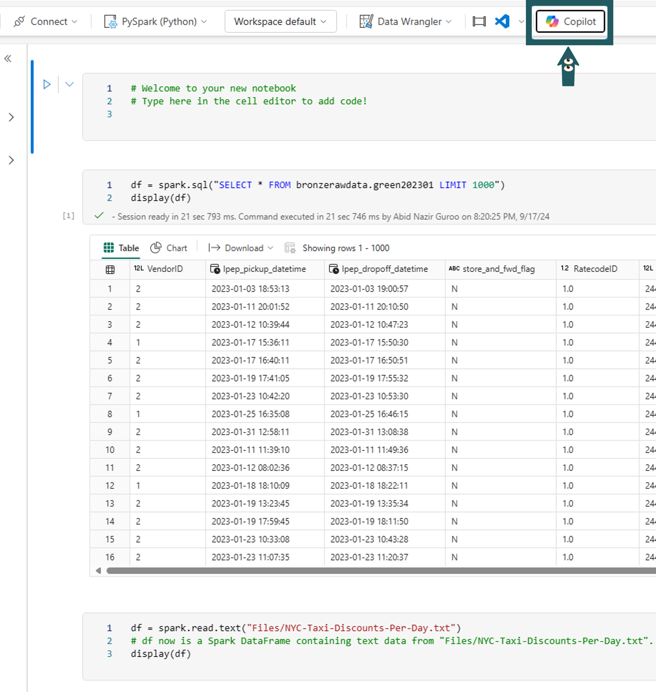

## Zacznij pracę z asystentem Copilot
Gdy otworzy się panel Copilot, kliknij `Get Started`, żeby zacząć rozmowę z asystentem AI.
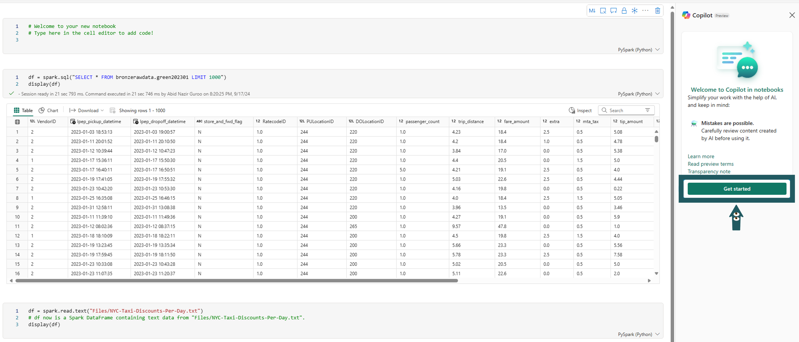

## Instalacja bibliotek
Copilot automatycznie wstawi nową komórkę ze skryptem, który instaluje potrzebne biblioteki. Uruchom tę komórkę przyciskiem `Play`, żeby zainstalować biblioteki wymagane przez funkcje Copilot.


## Prywatność i bezpieczeństwo danych
Po instalacji zobaczysz informację o prywatności i bezpieczeństwie danych. Przeczytaj ją, żeby wiedzieć, jak twoje dane są przechowywane i przetwarzane. Znajdziesz tam też wskazówki, jak skutecznie rozmawiać z asystentem Copilot.


## Rozmowa z asystentem Copilot
Teraz wypróbuj różne prompty dotyczące twoich danych. Poproś o fragmenty kodu albo o wyjaśnienia. Wygenerowany kod możesz wkleić do nowej komórki Notebooka. To okazja, żeby sprawdzić, jak Copilot pomaga w zadaniach z obszaru Data Science i Data Engineering.

> [!TIP]
> Zadawaj asystentowi Copilot dowolne pytania, żeby lepiej poznać zbiór danych i więcej wynieść z warsztatu.
> Przykład: `Analyze my table named green_202201_202301 and provide insights about the data`. 


Ta krótka demonstracja pokazuje, jak łatwo sięgnąć po Copilot przy analizie danych.

> [!IMPORTANT]  
> Copilot ma cię wspierać i podpowiadać jako „drugi pilot”, a nie przejmować stery jako „pilot”. 
> Dalej pracujemy według zaplanowanych ćwiczeń i tej dokumentacji. To one będą naszym drugim pilotem, a nie sam Copilot.


# SQL Analytics Endpoint

**SQL Analytics Endpoint** w Fabric Lakehouse pozwala analizować dane w tabelach Delta w Lakehouse za pomocą języka T-SQL. Możesz w nim zapisywać funkcje, tworzyć widoki i stosować zabezpieczenia SQL.

Gdy udostępniasz Lakehouse, użytkownicy automatycznie dostają uprawnienie Read. Obejmuje ono sam Lakehouse i powiązany SQL analytics endpoint. Od 5 września 2025 roku Fabric nie tworzy już domyślnego semantic model. Semantic model tworzysz samodzielnie, tak jak w Ćwiczeniu 4. Oprócz tego standardowego dostępu możesz nadać użytkownikom:

-   uprawnienie **ReadData** do SQL endpoint, które daje dostęp do danych bez wymuszania zasad SQL.
-   uprawnienie **ReadAll** do Lakehouse, które daje pełny dostęp do danych przez Apache Spark.
-   uprawnienie **Build** do semantic model, który samodzielnie utworzysz na tym Lakehouse. Pozwala ono tworzyć raporty Power BI na tym modelu.

Cel tego ćwiczenia: zdobyć ciąg połączenia SQL do SQL analytics endpoint twojego Lakehouse. Bez niego nie połączysz się z danymi i nie odpytasz ich z narzędzi opartych na SQL.

1. **Przejdź do SQL analytics endpoint**:
   - Przejdź do swojego workspace i znajdź SQL analytics endpoint swojego Lakehouse.
   - Kliknij `More options` (zwykle trzy kropki, czyli ikona wielokropka) przy SQL analytics endpoint.

2. **Skopiuj ciąg połączenia SQL**:
   - Z dostępnych opcji wybierz `Copy SQL connection string`.
   - Ciąg połączenia trafi do schowka. Masz już wszystko, czego potrzebujesz do nawiązania połączenia SQL.
     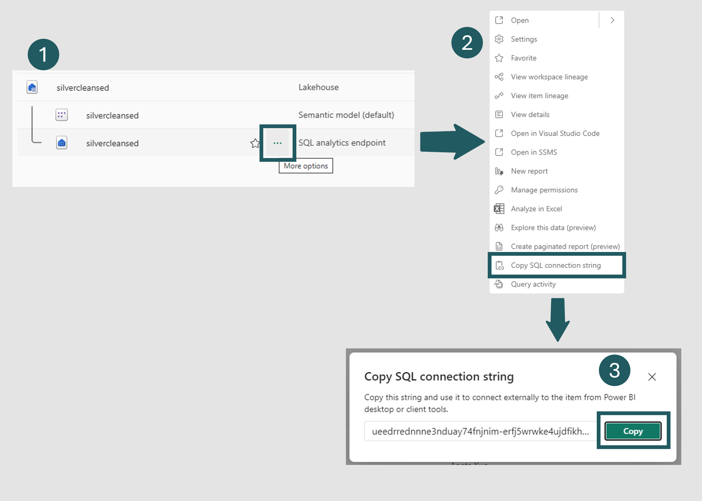

3. **Użyj ciągu połączenia**:
   - Ciąg połączenia jest w schowku, więc możesz połączyć się z SQL analytics endpoint swojego Lakehouse.
   - Otwórz wybrane narzędzie bazodanowe, na przykład SQL Server Management Studio (SSMS) albo rozszerzenie MSSQL dla VS Code. Azure Data Studio zostało wycofane 28 lutego 2026 roku.
   - Otwórz okno nowego połączenia, wklej ciąg połączenia w odpowiednie pole i postępuj zgodnie z instrukcjami na ekranie, żeby nawiązać połączenie.

Przechowuj ciąg połączenia bezpiecznie, bo daje on dostęp do twoich danych w Lakehouse. Nie udostępniaj go publicznie i nie zapisuj w niezabezpieczonych miejscach. Jeśli kopiowanie albo użycie ciągu połączenia sprawia problem, sprawdź ustawienia i uprawnienia w workspace swojego Lakehouse albo zajrzyj do dokumentacji.

---

# Połącz się z Fabric SQL Endpoint za pomocą SQL Server Management Studio (SSMS)
> [!TIP]
> Jeśli interesuje cię Lineage i połączenie z narzędzi zewnętrznych, [przejdź do tego dodatkowego ćwiczenia](../exercise-extra/extra.md#lineage).
 
Cel tego zadania: połączyć się z Fabric SQL Endpoint z poziomu SQL Server Management Studio (SSMS), żeby odpytywać dane i zarządzać nimi bezpośrednio w SSMS. [Pobierz najnowszą ogólnie dostępną (GA) wersję SQL Server Management Studio (SSMS)](https://aka.ms/ssmsfullsetup). Link pobiera aktualne wydanie, obecnie SSMS 22.

1. **Otwórz SQL Server Management Studio**:
   - Uruchom SSMS na swoim komputerze. Po otwarciu aplikacji okno `Connect to Server` powinno pojawić się automatycznie. Jeśli SSMS jest już otwarty, ale bez połączenia, przejdź do Object Explorer, kliknij `Connect` i wybierz `Database Engine`.

2. **Wpisz dane serwera**:
   - W oknie połączenia wklej w pole `Server name` skopiowany wcześniej ciąg połączenia SQL. Ten ciąg powinien odpowiadać twojemu Fabric SQL Endpoint.

3. **Uwierzytelnianie**:
   - Jako metodę uwierzytelniania wybierz `Microsoft Entra Password`. W SSMS 22 zalecana opcja nazywa się `Microsoft Entra MFA`. Dzięki temu połączenie jest bezpieczne i korzysta z nowoczesnych metod uwierzytelniania.

    

4. **Wpisz dane logowania**:
   - W oknie uwierzytelniania, które się pojawi, wpisz adres e-mail użytkownika warsztatowego albo swój firmowy adres e-mail. Postępuj zgodnie z instrukcjami na ekranie, żeby przejść uwierzytelnianie MFA.

5. **Przejrzyj Lakehouse**:
   - Po połączeniu panel Object Explorer w SSMS pokaże podłączony Lakehouse. Rozwiń węzeł serwera, żeby zobaczyć bazy danych (Lakehouse). Możesz przeglądać tabele, widoki i inne obiekty dostępne dla zapytań.

> [!IMPORTANT]
> Pamiętaj, żeby bezpiecznie obchodzić się z wrażliwymi informacjami, takimi jak ciągi połączenia i dane logowania. Upewnij się, że masz odpowiednie uprawnienia do danych i do SQL endpoint. Jeśli połączenie nie działa, sprawdź ciąg połączenia i dane uwierzytelniania. Sprawdź też ustawienia sieci i reguły zapory, które mogą blokować połączenie z Fabric SQL Endpoint.

---

# Uruchom zapytania T-SQL na tabelach Delta w Lakehouse

Uruchom serię zapytań T-SQL na tabelach Delta w Lakehouse. Skupiamy się na analizie tabeli NYC Taxi z bazy danych `silvercleansed`. Na tych zapytaniach poznasz agregację danych, tworzenie widoków i podstawowe operacje SQL w środowisku Lakehouse.

1. **Policz wiersze w tabeli NYC Taxi**:
   - Uruchom poniższe zapytanie SQL, żeby poznać łączną liczbę wierszy w tabeli `green_202201_202301_cleansed`:
     ```sql
     SELECT COUNT(*)
     FROM [silvercleansed].[dbo].[green_202201_202301_cleansed];
     ```

2. **Oblicz średnią opłatę i średni napiwek**:
   - Uruchom poniższe zapytanie, żeby obliczyć średnią opłatę za przejazd i średni napiwek w tej samej tabeli:
     ```sql
     SELECT ROUND(AVG([fare_amount]),2) AS [Average Fare], 
     ROUND(AVG([tip_amount]),2) AS [Average Tip] 
     FROM [silvercleansed].[dbo].[green_202201_202301_cleansed];
     ```

3. **Zagreguj opłaty według liczby pasażerów**:
   - Użyj poniższego zapytania, żeby otrzymać sumę i średnią opłat w podziale na liczbę pasażerów, posortowane malejąco według średniej opłaty:
     ```sql
     SELECT DISTINCT [passenger_count], 
     ROUND(SUM([fare_amount]),0) as TotalFares,
     ROUND(AVG([fare_amount]),0) as AvgFares
     FROM [silvercleansed].[dbo].[green_202201_202301_cleansed]
     GROUP BY [passenger_count]
     ORDER BY AvgFares DESC;
     ```

4. **Porównaj przejazdy z napiwkiem i bez napiwku**:
   - Uruchom to zapytanie, żeby porównać liczbę przejazdów, w których dano napiwek, z liczbą przejazdów bez napiwku:
     ```sql
     SELECT tipped, COUNT(*) AS tip_freq FROM (
       SELECT CASE WHEN (tip_amount > 0) THEN 1 ELSE 0 END AS tipped, tip_amount
       FROM [silvercleansed].[dbo].[green_202201_202301_cleansed]
       WHERE [lpep_pickup_datetime] BETWEEN '20220101' AND '20230131') tc
     GROUP BY tipped;
     ```

5. **Utwórz widok ze średnią i sumą opłat według liczby pasażerów**:
   - Uruchom poniższe polecenie SQL, żeby utworzyć widok na podstawie zapytania z kroku 3:
     ```sql
     CREATE VIEW [dbo].[viGetAverageFares]
     AS 
     SELECT DISTINCT [passenger_count], 
     ROUND(SUM([fare_amount]),0) as TotalFares,
     ROUND(AVG([fare_amount]),0) as AvgFares
     FROM [silvercleansed].[dbo].[green_202201_202301_cleansed]
     GROUP BY [passenger_count];
     ```

6. **Odpytaj nowo utworzony widok**:
   - Na koniec pobierz dane z nowego widoku, żeby sprawdzić, czy został poprawnie utworzony:
     ```sql
     SELECT * FROM [silvercleansed].[dbo].[viGetAverageFares];
     ```

> [!IMPORTANT]
> Upewnij się, że masz uprawnienia do uruchamiania tych zapytań i tworzenia widoków w Lakehouse. Zwracaj uwagę na składnię i strukturę bazy danych, żeby wyniki były poprawne. Zapisuj ciekawe obserwacje i anomalie zauważone podczas analizy, żeby wrócić do nich później albo omówić je w grupie.

---

# Udostępnianie Lakehouse

Dowiesz się, jak udostępnić Lakehouse członkom zespołu albo interesariuszom w swoim workspace i nadać im odpowiedni poziom dostępu.

1. **Przejdź do swojego Lakehouse**:
   - W swoim workspace znajdź Lakehouse, który chcesz udostępnić.
   - Kliknij przycisk **Share** obok nazwy Lakehouse.
     

2. **Skonfiguruj udostępnianie**:
   - W oknie udostępniania wpisz nazwę albo adres e-mail osób, którym chcesz udostępnić Lakehouse.
   - Nadaj odpowiednie uprawnienia, zaznaczając właściwe pola wyboru. Domyślnie udostępnienie Lakehouse daje dostęp do Lakehouse i powiązanego SQL analytics endpoint. Dodatkowe pola w aktualnym oknie to `Read all with SQL analytics endpoint` i `Read all with Apache Spark`.
   
   

3. **Ustawienia powiadomień**:
   - Jeśli chcesz powiadomić odbiorców e-mailem, zaznacz opcję **`Notify recipients by mail`**.
   - Możesz dodać wiadomość z kontekstem albo instrukcjami dla odbiorców.

4. **Zakończ udostępnianie**:
   - Gdy skonfigurujesz udostępnianie i powiadomienia, kliknij **Grant**, żeby udostępnić Lakehouse.

> [!IMPORTANT]
> Udostępniaj Lakehouse tylko osobom, które potrzebują dostępu, i nadawaj im uprawnienia odpowiednie do potrzeb i roli. Przy udostępnianiu zasobów Lakehouse stosuj zasady swojej organizacji dotyczące udostępniania danych i prywatności. Zapisuj, kto ma dostęp do Lakehouse. Przyda się to później i ułatwi spełnienie wymagań bezpieczeństwa.

---

# Udostępnianie Notebooka do współpracy

Dowiesz się, jak udostępnić Notebook członkom zespołu w swoim workspace i współpracować z nimi na wybranych uprawnieniach.

1. **Otwórz Notebook**:
   - Przejdź do Notebooka, który chcesz udostępnić.
   - Kliknij przycisk **Share** na pasku narzędzi Notebooka.
     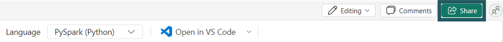

2. **Ustaw uprawnienia**:
   - W ustawieniach udostępniania wybierz kategorię **people who can view this notebook**.
   - Nadaj odpowiednie uprawnienia: **Share**, **Edit** albo **Run**. Od nich zależy, co odbiorcy będą mogli zrobić z Notebookiem.
     

3. **Udostępnij Notebook**:
   - Po ustawieniu uprawnień kliknij **Apply**.
   - Następnie możesz wysłać Notebook bezpośrednio do członków zespołu albo skopiować link i rozesłać go samodzielnie. Odbiorcy otworzą Notebook zgodnie z ustawionymi uprawnieniami.
     

4. **Zarządzaj uprawnieniami do Notebooka**:
   - Żeby ustawić dodatkowe uprawnienia albo zmienić dostęp, przejdź do listy elementów w workspace.
   - Kliknij **More options** obok swojego Notebooka i wybierz **Manage permissions**. Tutaj zmienisz, kto ma dostęp i na jakim poziomie.
     


> [!NOTE]
> Przy udostępnianiu pamiętaj, jakie dane i informacje zawiera Notebook. Dostęp powinny dostać tylko właściwe osoby. Sprawdź zasady swojej organizacji dotyczące udostępniania danych i współpracy, żeby spełnić standardy bezpieczeństwa i prywatności. Zapisuj problemy napotkane podczas udostępniania. Takie notatki przydadzą się później albo wtedy, gdy poprosisz o pomoc.

---

# High concurrency mode w Fabric Spark

High concurrency mode pozwala użytkownikom współdzielić tę samą Spark session w Fabric Spark przy zadaniach Data Engineering i Data Science. Element taki jak Notebook wykonuje się w standardowej Spark session. W High concurrency mode jedna Spark session obsługuje niezależne wykonywanie wielu elementów. Każdy element działa w osobnym rdzeniu read-eval-print loop (REPL) wewnątrz aplikacji Spark. Rdzenie REPL izolują elementy od siebie. Dzięki temu lokalnych zmiennych Notebooka nie nadpiszą zmienne o tej samej nazwie z innych Notebooków, które współdzielą sesję.

> [!TIP]
> W custom pools z High concurrency mode sesja startuje 36 razy szybciej niż standardowa Spark session.

Żeby włączyć HC w swoim Notebooku, wykonaj te kroki:

1. Przejdź do karty Run na wstążce menu i rozwiń listę typu sesji, na której domyślnie wybrana jest opcja Standard. Wybierz New high concurrency session.


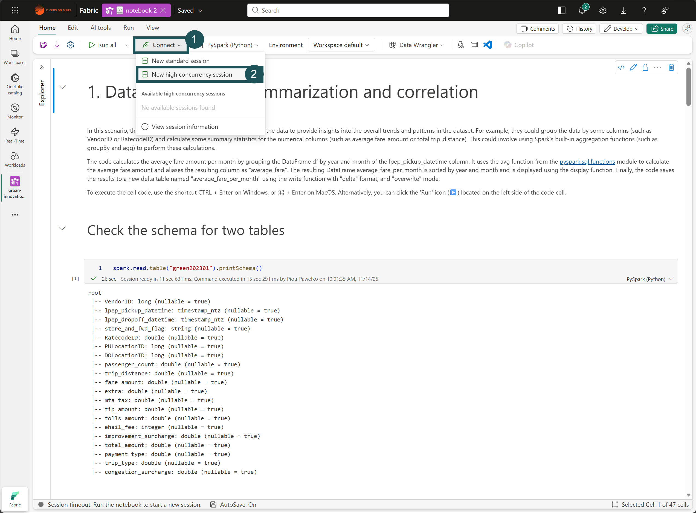

2. Gdy high concurrency session wystartuje, możesz dodać do niej maksymalnie 5 Notebooków.

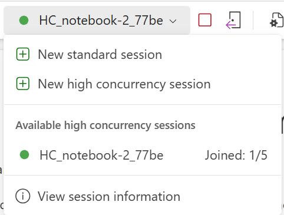


3. Kroki Notebooka możesz uruchamiać od razu.

Więcej o high concurrency session [przeczytasz tutaj.](https://learn.microsoft.com/en-us/fabric/data-engineering/configure-high-concurrency-session-notebooks)


---

# Lineage

Poznaj zależności i przepływ danych w swoim workspace Fabric w widoku Lineage. Każdy workspace automatycznie ma widok Lineage.

1. **Otwórz widok Lineage**:
   - Przejdź do paska narzędzi workspace w swoim środowisku Fabric.
   - Otwórz widok Lineage, żeby zobaczyć, jak elementy w twoim workspace są ze sobą połączone.
     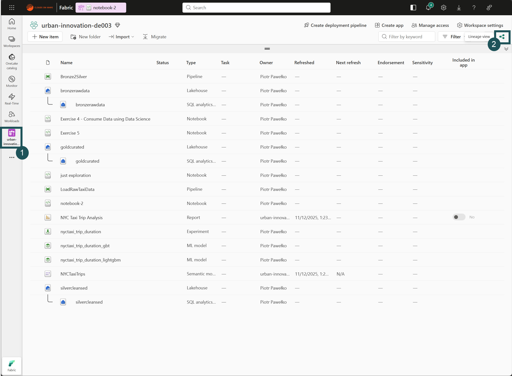

2. **Przejrzyj elementy workspace i połączenia**:
   - W widoku Lineage przejrzyj połączenia między wszystkimi elementami w swoim workspace.
   - Znajdź połączenia upstream, które są o jeden poziom wyżej i leżą poza workspace. Rozpoznasz je po nazwie zewnętrznego workspace na karcie elementu. 

3. **Wyróżnij Lineage wybranego elementu**:
   - Żeby wyróżnić Lineage konkretnego elementu, kliknij strzałkę w prawym dolnym rogu karty.
   
     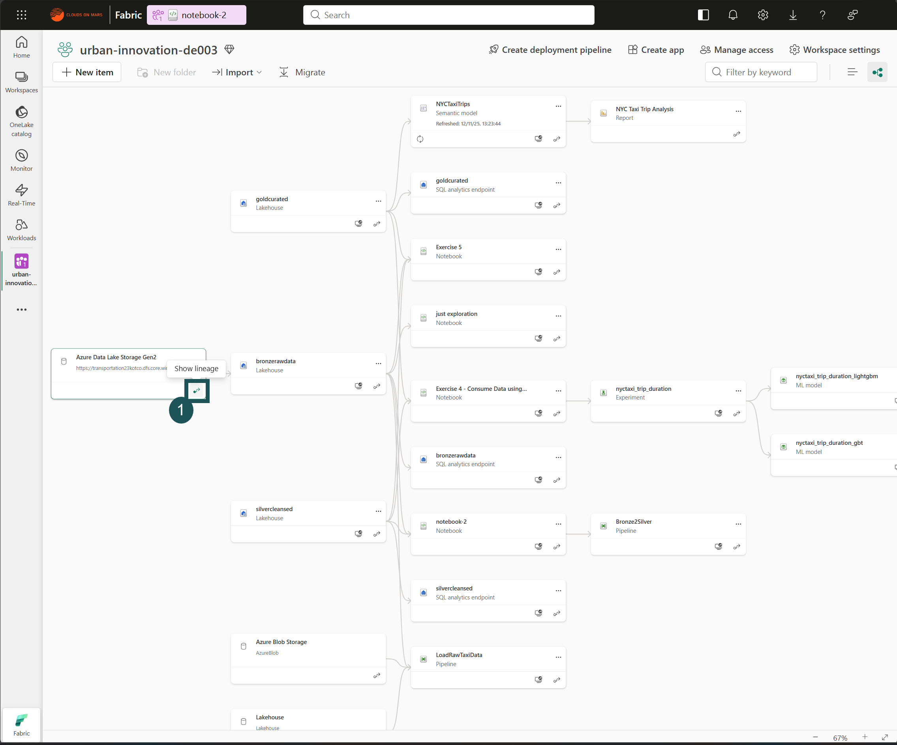

4. **Poznaj integrację z narzędziami zewnętrznymi**:
   - Zwróć uwagę na rolę narzędzi zewnętrznych, takich jak VS Code z rozszerzeniem MSSQL albo SQL Server Management Studio (SSMS), w zarządzaniu bazami danych i w ich rozwijaniu na różnych platformach.
   
     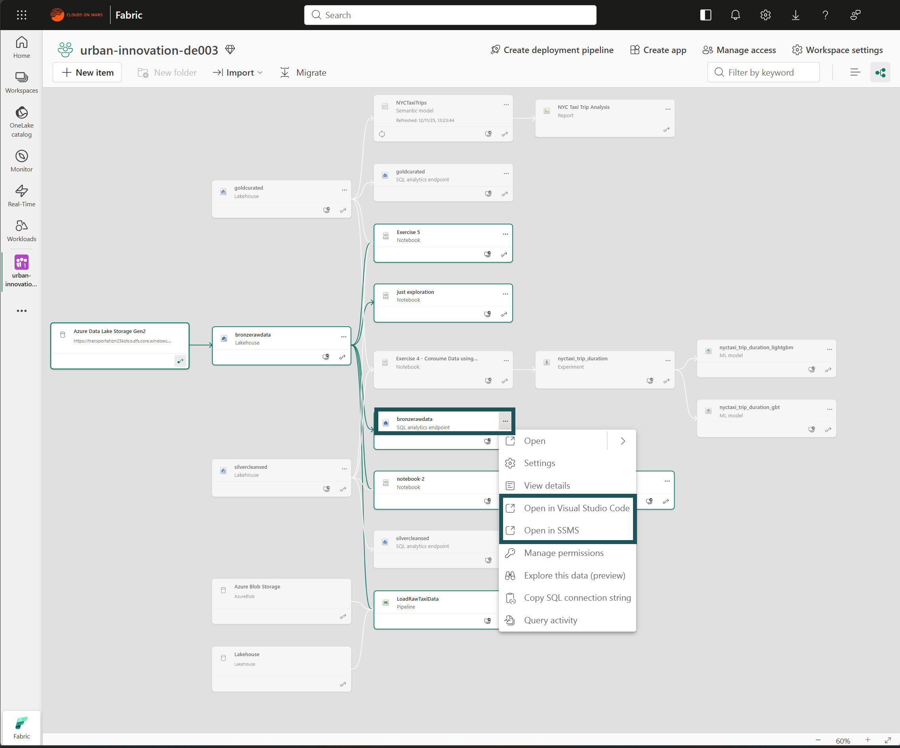

# Wybierz format pliku i typ kompresji docelowych zbiorów danych w Data Factory

Według Wikipedii Snappy (wcześniej Zippy) to szybka biblioteka do kompresji i dekompresji danych opracowana przez Google. Stawia na szybkość zamiast na maksymalną kompresję. Zysk na szybkości jest duży: 250 MB/s przy kompresji i 500 MB/s przy dekompresji na jednym rdzeniu procesora Core i7 2,26 GHz z okolic 2011 roku. Współczynnik kompresji jest jednak o 20–100% niższy niż w gzip. Więcej szczegółów znajdziesz w [artykule o Snappy w Wikipedii](https://en.wikipedia.org/wiki/Snappy_(compression)).

Po tych informacjach możesz się zastanawiać, skąd decyzja o użyciu gzip zamiast Snappy i jak zmienić to ustawienie. Zrób to tak:

1. Przejdź do widoku workspace i otwórz pierwszy utworzony przez ciebie Pipeline, który ładuje dane surowe do Lakehouse bronze.
2. W Pipeline przejdź do karty 'Source', a potem kliknij 'Settings'.
3. Następnie przejrzyj wszystkie typy kompresji obsługiwane dla formatu Parquet. Wybór właściwego typu kompresji bywa trudny, dlatego porównajmy dwa główne: Snappy i gzip.

   - **Snappy**: jak podaje Wikipedia, stawia na szybkość, a nie na maksymalną kompresję.
   - **Gzip**: to narzędzie nie uwzględnia struktury danych w pliku, ale często daje lepszą ogólną kompresję plików Parquet.

O wyborze powinno decydować to, co planujesz zrobić z danymi ładowanymi do warstwy bronze i jak będą używane później. Na przykład: czy trafią do warstwy silver albo gold i jak często ktoś będzie po nie sięgał.

Typ kompresji zmienisz w menu ustawień na karcie Source:

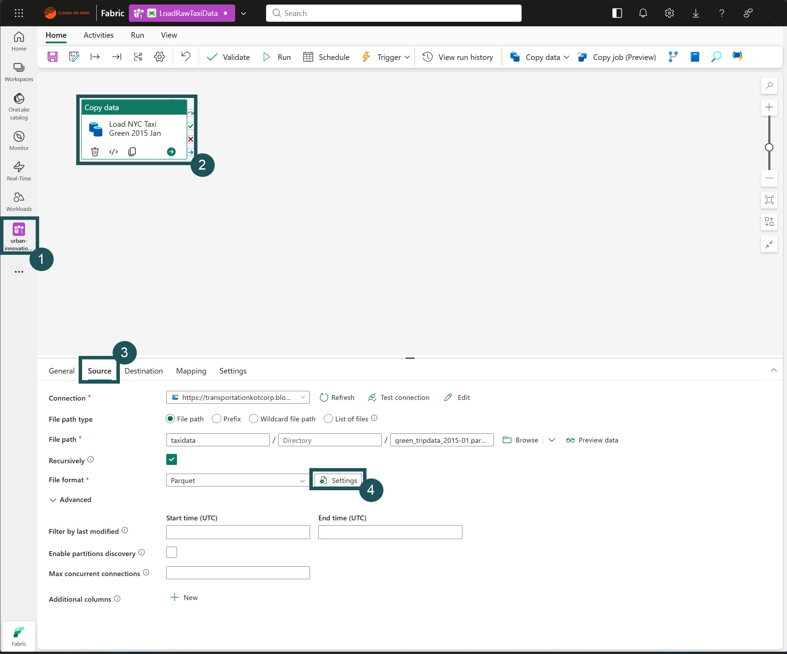

Według benchmarków gzip lepiej nadaje się do długoterminowego przechowywania danych statycznych, dlatego jest preferowany dla danych w warstwie gold. Dla danych używanych częściej (hot data) lepszy może być Snappy albo LZO:


Wybór typu kompresji zależy od twoich potrzeb: wzorców dostępu do danych, kosztów przechowywania i wymagań wydajnościowych.


---

# Monitoruj uruchomienie Pipeline i sprawdź wynik

Monitoring hub w Microsoft Fabric pozwala monitorować aktywności z jednego miejsca. Pamiętaj, że hub pokazuje tylko aktywności elementów, do których masz uprawnienia.

W tym ćwiczeniu sprawdzimy w Monitoring hub nasz Pipeline i nasze Notebooki.

1. Żeby otworzyć Monitoring hub, wybierz "Monitoring" w okienku nawigacji. Hub pokazuje informacje w tabeli. Aktywności Fabric są ułożone według czasu rozpoczęcia, najnowsze na górze.

2. Przyciskiem "Filter" zawęź wyniki w tabeli Monitoring hub, tak jak na zrzucie ekranu. Ułatwi to nawigację.
   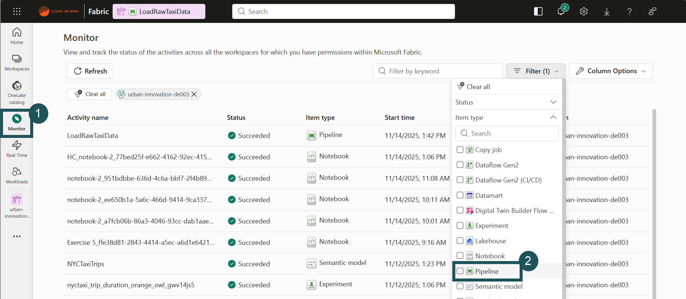

3. Z przefiltrowanych wyników otwórz konkretny Pipeline, tak jak na poniższym obrazie:
   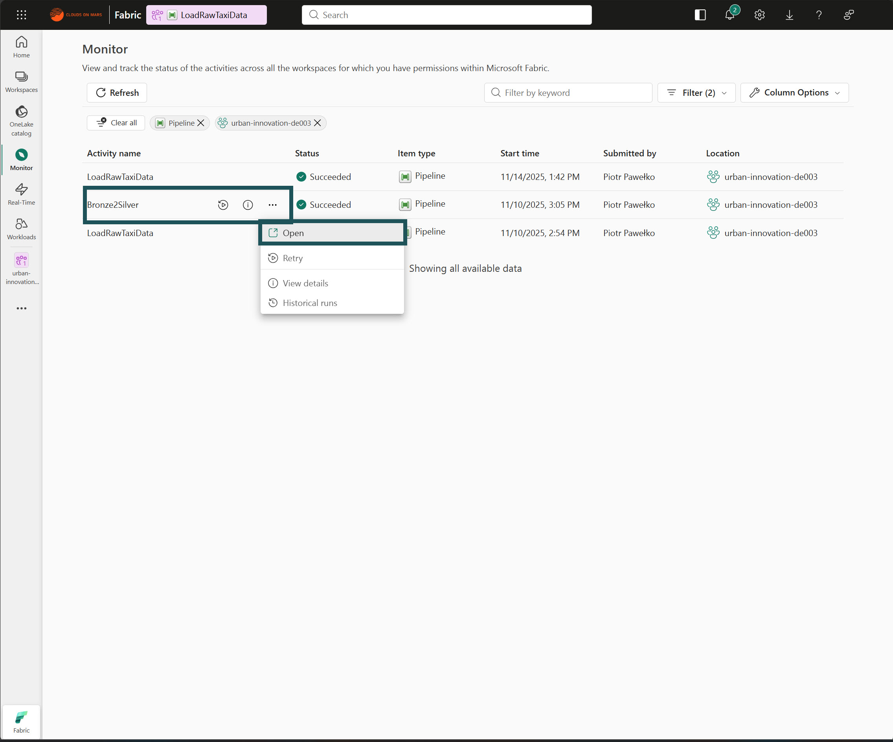

4. W Monitoring hub przełącz się na "Gantt Tab", żeby zobaczyć czasy wykonania Notebooków. O udanym wykonaniu świadczy przewaga koloru zielonego.
   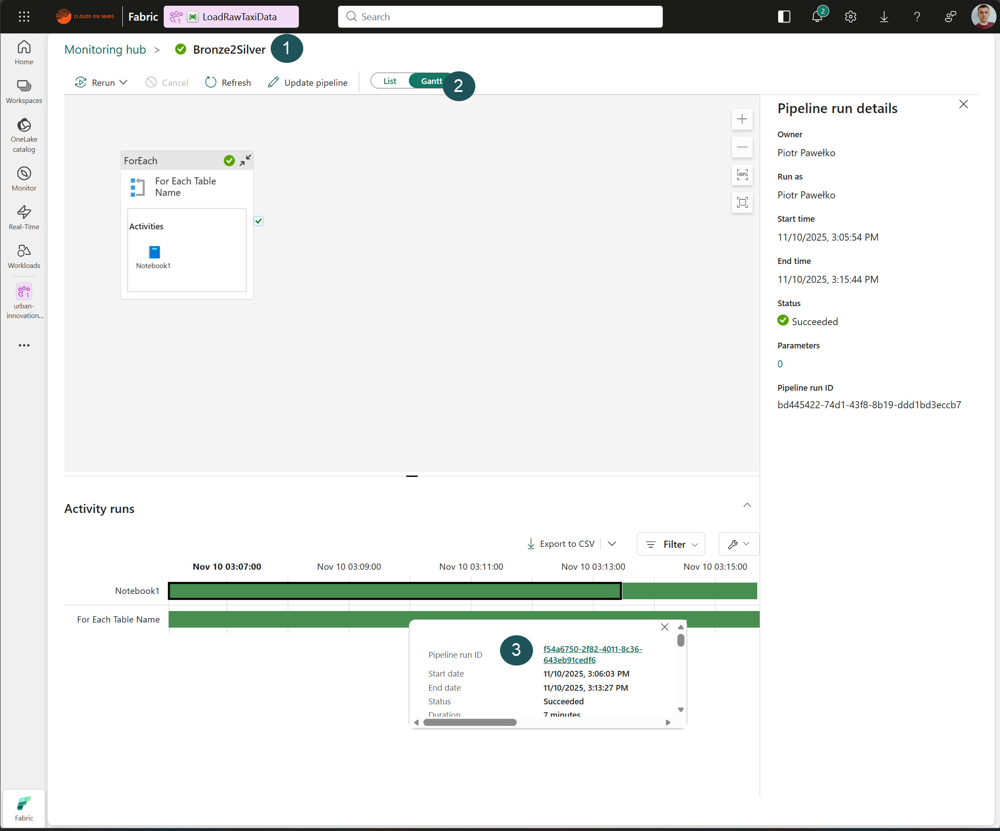

5. Kliknij nazwę Notebooka, który monitorujesz.
   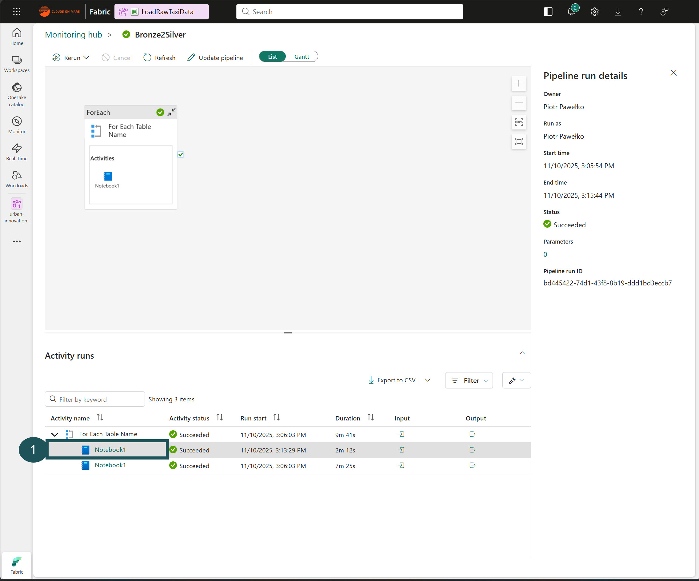

6. W widoku szczegółów Notebooka zwróć uwagę na dwie ważne sekcje: Spark monitoring URL i monitoring snapshot. Kliknij "Monitoring Snapshot".
   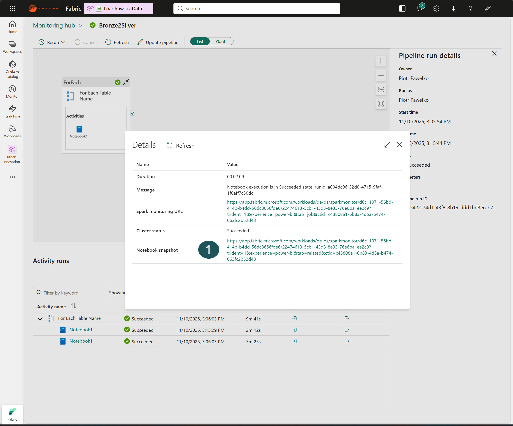

7. W monitoring snapshot przewiń zawartość, żeby zobaczyć wartości wykonane w Notebooku. Dzięki temu widzisz dokładnie, jakie operacje zostały wykonane.
   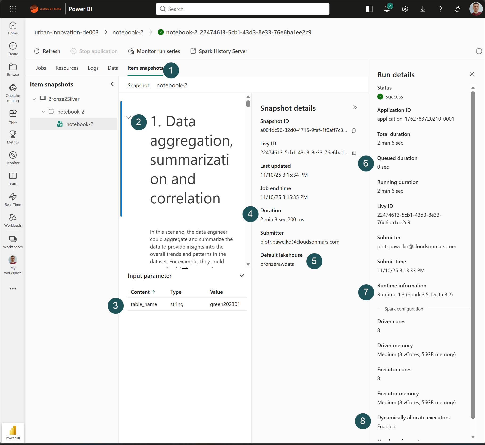

8. Zwróć uwagę na sekcję parametrów. Pokazuje ona, jak Notebook został sparametryzowany, na przykład nazwą tabeli "green202301".

9. Przejrzyj szczegóły wykonania, takie jak czas trwania, ustawienie domyślnego Lakehouse i czas oczekiwania w kolejce, żeby ocenić sprawność i wydajność swojego joba.

10. Wróć do karty "Resources" i przejrzyj metryki, takie jak łączny czas trwania, łączny czas bezczynności i efektywność. Niska efektywność, na przykład 15%, oznacza, że Pipeline, kod i ustawienia mocy obliczeniowej można jeszcze sporo poprawić.
    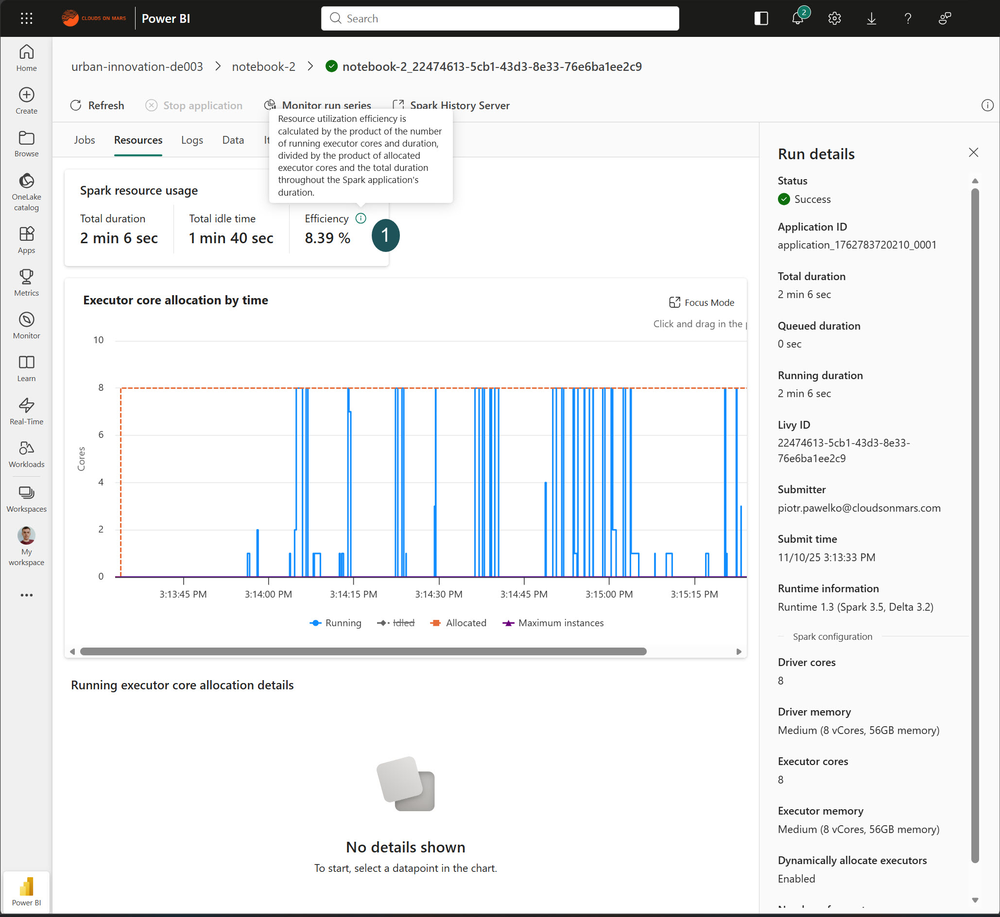

Podziel się pomysłami na optymalizację z prowadzącymi warsztat i z innymi uczestnikami, żeby poprawić ogólną wydajność swojego Pipeline.

---

# Medallion architecture
Medallion architecture to wzorzec projektowania danych, który porządkuje dane w Lakehouse. Jego cel: stopniowo poprawiać jakość i strukturę danych, gdy przepływają przez kolejne warstwy, od warstwy bronze, przez warstwę silver, do warstwy gold.


Takie stopniowe ulepszanie pozwala utrzymać jakość i strukturę danych, a przy tym poprawia wydajność przetwarzania. Medallion architecture bywa nazywana architekturą „multi-hop”, bo dane przepływają przez wiele warstw.

Jedna z głównych zalet architektury Lakehouse to prosty model danych, łatwy do zrozumienia i wdrożenia. Umożliwia też przyrostowe operacje ETL (extract, transform, load), więc nowe dane dodajesz do Lakehouse w sposób skalowalny i łatwy w zarządzaniu.

Kolejna zaleta architektury Lakehouse: w każdej chwili możesz odtworzyć tabele z danych surowych. To możliwe, bo Delta Lake zapewnia transakcje ACID i funkcję time travel. Dzięki nim śledzisz zmiany w danych i w razie potrzeby łatwo wracasz do poprzednich wersji.

## Przejrzyj Medallion architecture w Fabric Lakehouse

Po oczyszczeniu i transformacji danych w Lakehouse możesz zapisać wynik do innego Lakehouse, zgodnie ze wzorcem „bronze->silver->gold”.

Oto przykładowy fragment kodu, który zapisuje dane do innego Lakehouse:

```python
# odczytaj dane z Lakehouse bronze
bronze_df = spark.read.table("bronze_lakehouse_name.lakehouse_table")

# oczyść i przekształć dane
# ...

# zapisz przekształcone dane do Lakehouse silver
transformed_df.write.format("delta").mode("overwrite").saveAsTable("silver_lakehouse_name.lakehouse_table")

```
W tym przykładzie najpierw odczytujemy dane z Lakehouse bronze metodą spark.read. Potem oczyszczamy i przekształcamy dane w DataFrame bronze_df. Na koniec zapisujemy przekształcone dane do Lakehouse silver metodą transformed_df.write. Podajemy ścieżkę do Lakehouse silver i ustawiamy tryb zapisu "overwrite", żeby zastąpić istniejące dane.

Nasz rzeczywisty przypadek, jeszcze raz:

```python
table_name  = "green_202201_202301"

data_collection = table_name[:-6]  # Wyodrębnia wszystkie znaki oprócz ostatnich sześciu (zakłada, że nie są to cyfry)
extracted_year = table_name[-6:-2]  # Wyodrębnia cztery cyfry oznaczające rok
extracted_month = table_name[-2:]  # Wyodrębnia dwie ostatnie cyfry oznaczające miesiąc

from pyspark.sql.functions import col, year, month, dayofmonth, avg

# !!!!
# ODCZYT DANYCH SUROWYCH Z DOMYŚLNEGO (RAW) LAKEHOUSE
df = spark.read.table(table_name)

# Oblicz średnią opłatę za przejazd w każdym miesiącu
average_fare_per_month = (
    df
    .groupBy(year("lpep_pickup_datetime").alias("year"), month("lpep_pickup_datetime").alias("month"))
    .agg(avg("fare_amount").alias("average_fare"))
    .orderBy("year", "month")
)
display(average_fare_per_month)

result_table_name = f"{table_name}_avg_fare_per_month"

# Zapisz wyniki do nowej tabeli Delta - LAKEHOUSE SILVERCLEANSED - WARSTWA SILVER
average_fare_per_month.write.format("delta").mode("overwrite").saveAsTable(f"silvercleansed.{result_table_name}")
```

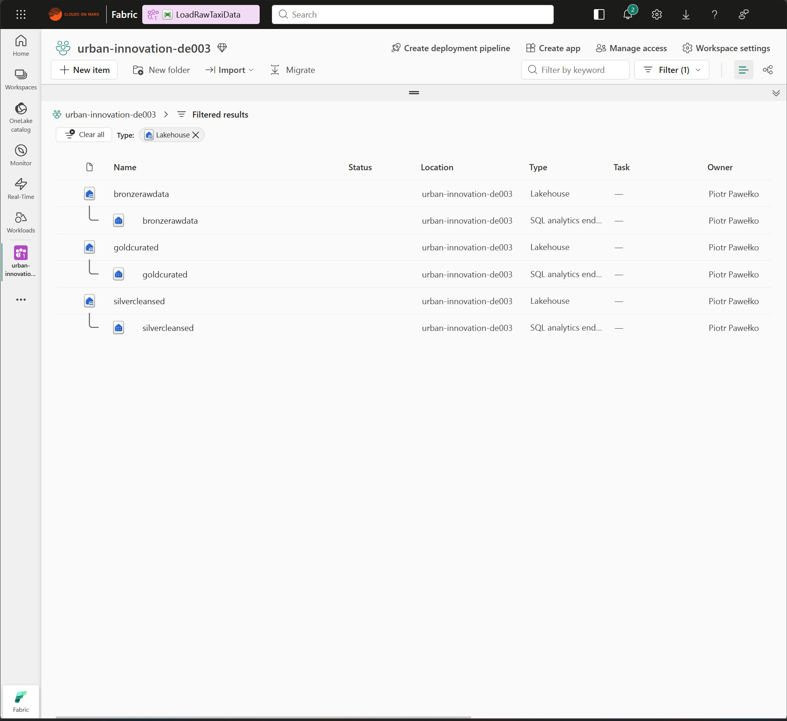

## Medallion Architecture Data Design and Lakehouse Patterns | Microsoft Fabric Data Factory

Obejrzyj odcinek Fabric Espresso, w którym Abhishek omawia i pokazuje Medallion Architecture Data Design and Lakehouse Patterns w Microsoft Fabric Data Factory.  
[](https://www.youtube.com/watch?v=706MVIBivOU)


---


# Zaplanuj uruchamianie Notebooka kilka razy dziennie

W tym ćwiczeniu nauczysz się planować uruchamianie Notebooka kilka razy dziennie za pomocą funkcji harmonogramu. Dla pojedynczego Notebooka to prostsze rozwiązanie niż Pipeline.

1. **Otwórz Notebook**:
   - Otwórz Notebook z drugiego ćwiczenia. 
   - Kliknij ikonę harmonogramu pokazaną na zrzucie ekranu, żeby otworzyć opcje planowania.
     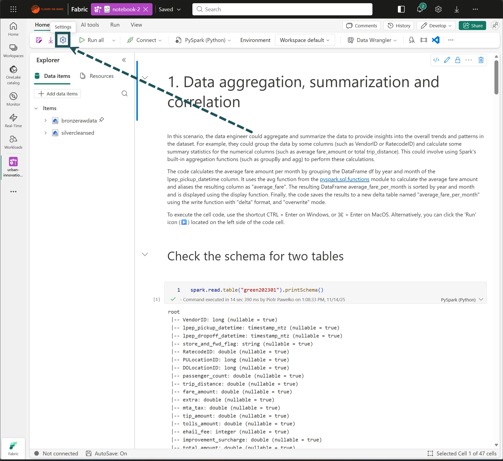

2. **Skonfiguruj harmonogram**:
   - Przełącz się na kartę "Schedule" i kliknij przycisk `Add Schedule`.
   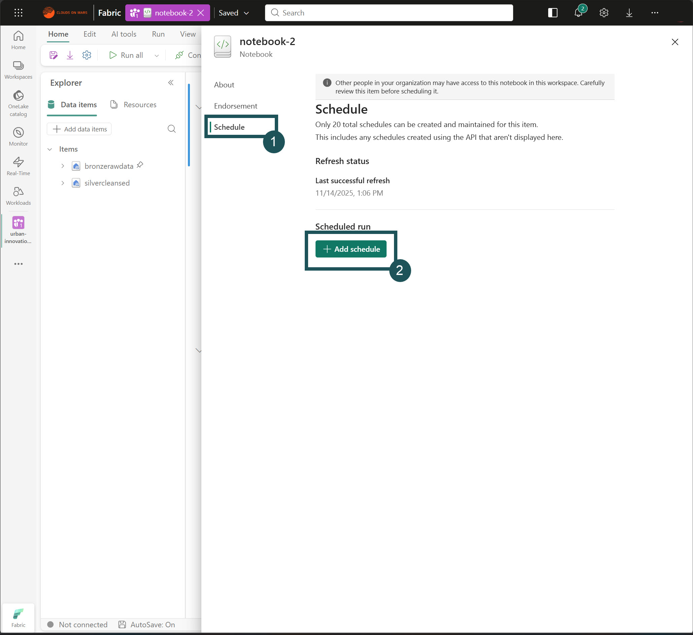
     
3. **Określ szczegóły harmonogramu**:
   - Ustaw codzienne powtarzanie Notebooka.
   - Ustaw godziny uruchomienia Notebooka, na przykład 7:00 AM i 10:00 AM. Dopasuj je do swojego trybu pracy i potrzeb przetwarzania danych.
   - Podaj datę początkową i końcową zaplanowanych uruchomień, czyli jak długo Notebook ma działać według tego harmonogramu.
   - Wybierz właściwą strefę czasową, żeby godziny uruchomień były poprawne.
   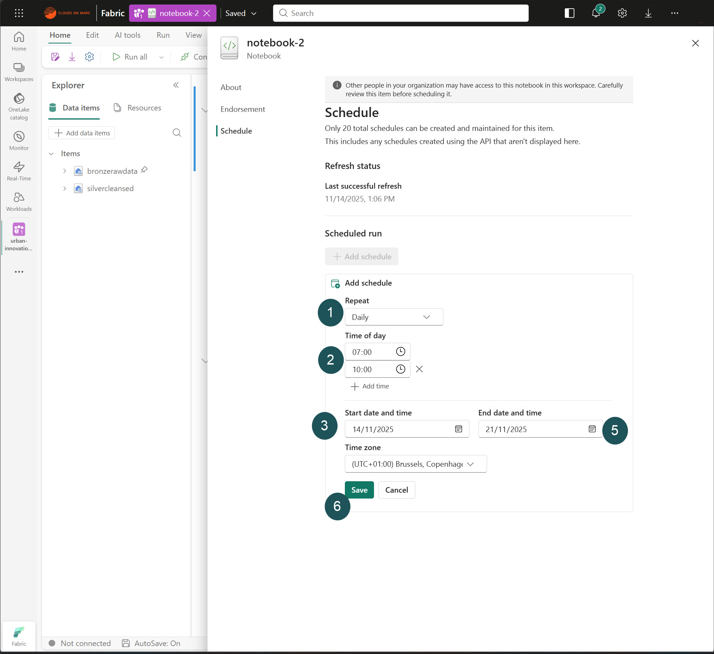

4. **Zastosuj i potwierdź zmiany**:
   - Po skonfigurowaniu ustawień zastosuj zmiany, żeby aktywować harmonogram.
   - Sprawdź, czy harmonogram jest ustawiony poprawnie i spełnia twoje wymagania.

5. **Monitorowanie i analiza historyczna**:
   - Gdy harmonogram jest aktywny, monitoruj uruchomienia w Monitoring hub. Zobaczysz, czy przebiegają zgodnie z planem.
   - Użyj analizy historycznej w Monitoring hub, żeby ocenić wydajność i wyniki zaplanowanych uruchomień Notebooka w czasie.

Dopasuj harmonogram do celów przetwarzania danych i do godzin pracy. Uruchamianie Notebooków poza godzinami szczytu pomaga lepiej wykorzystać zasoby i obniżyć koszty. Zapisuj problemy i wnioski z tego ćwiczenia, żeby podzielić się nimi z zespołem albo wrócić do nich później.


## Utwórz nowy Spark pool w ustawieniach workspace

W tym ćwiczeniu rozwiążesz problem braku dynamicznego wykonywania jobów: utworzysz nowy Spark pool w ustawieniach workspace. 

1. **Przejdź do Workspace settings**:
   - Przejdź do widoku workspace w swoim środowisku Microsoft Fabric.
   - Kliknij przycisk `Workspace settings`.
     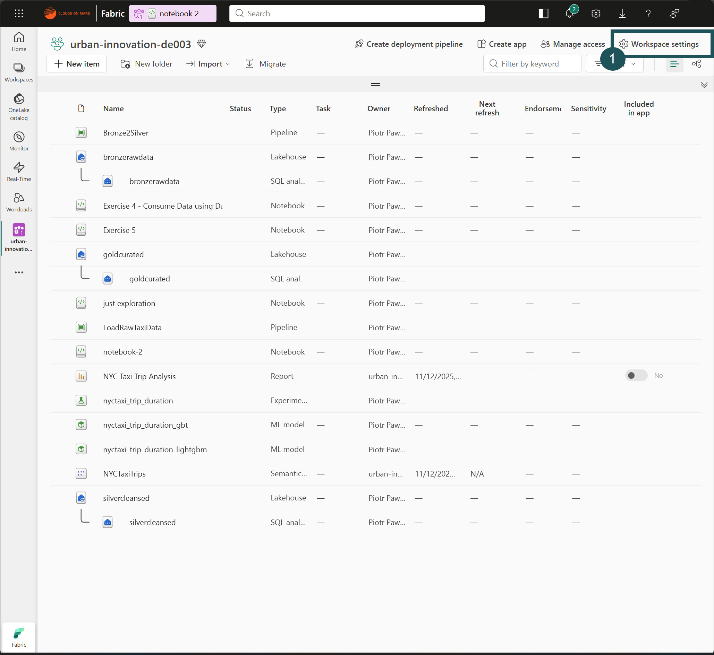

2. **Otwórz ustawienia Data Engineering/Science**:
   - Kliknij "Data Engineering/Science", a potem wybierz "Spark Settings".
   - Kliknij "Default Pool for Workspace" i rozwiń listę, żeby zobaczyć więcej opcji.
     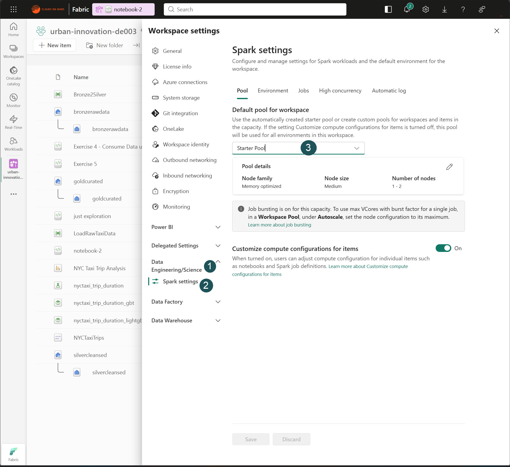

3. **Utwórz nowy Spark pool**:
   - Kliknij przycisk "New Pool", żeby zacząć konfigurację nowego Spark pool.
     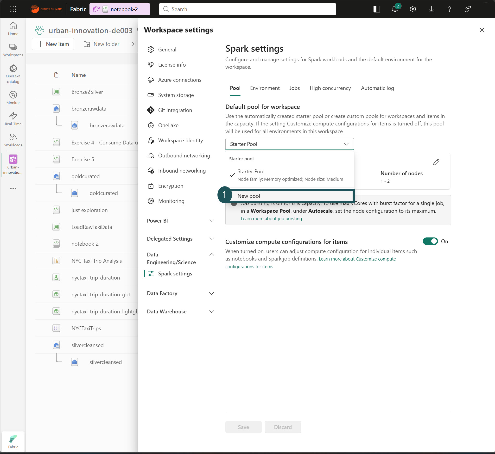

4. **Skonfiguruj nowy Spark pool**:
   - Nadaj nowemu Spark pool czytelną nazwę.
   - Wybierz rozmiar węzła dla swojego Spark pool. Fabric udostępnia tylko rodzinę węzłów "Memory Optimized". Wybierz ją i na przykład rozmiar węzła "Small".
   - Włącz autoskalowanie, żeby Spark pool automatycznie dopasowywał się do obciążenia.
   - Włącz "Dynamic Allocation for Executors", żeby lepiej wykorzystać zasoby podczas wykonywania jobów.
   - Zawsze pamiętaj, żeby po konfiguracji zapisać zmiany.
     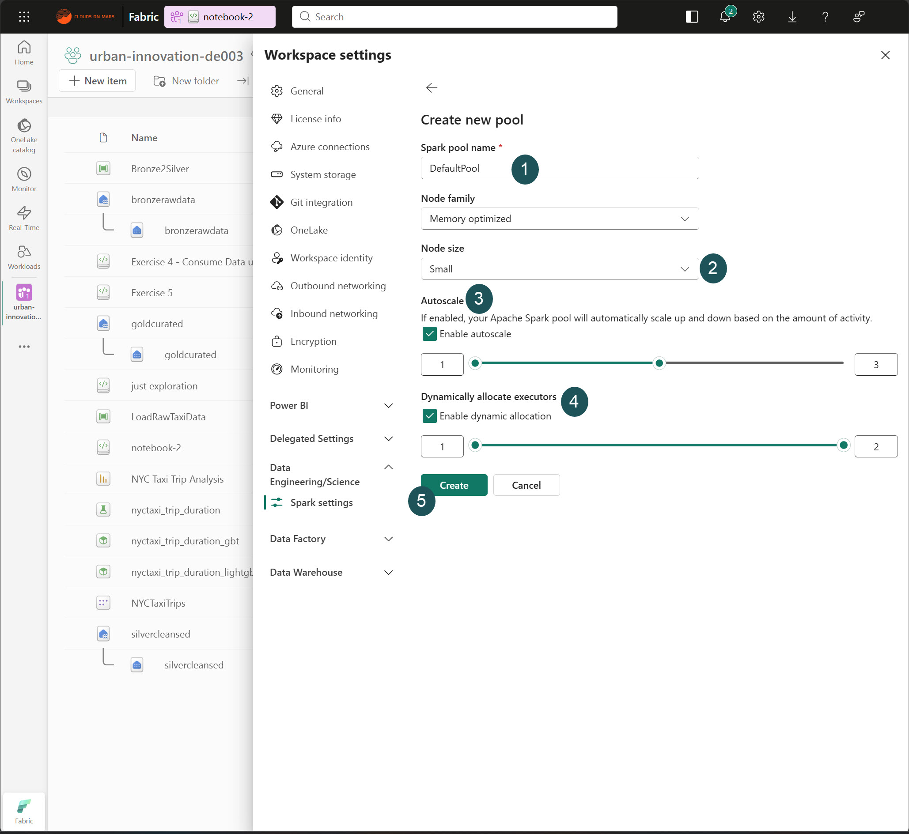

5. **Dokończ i zapisz zmiany**:
   - Po skonfigurowaniu nowego Spark pool Microsoft Fabric przeniesie cię z powrotem na ekran ustawień Spark.
   - W górnej części ekranu pojawi się komunikat o niezapisanych zmianach. Przejrzyj te zmiany i zapisz je.
     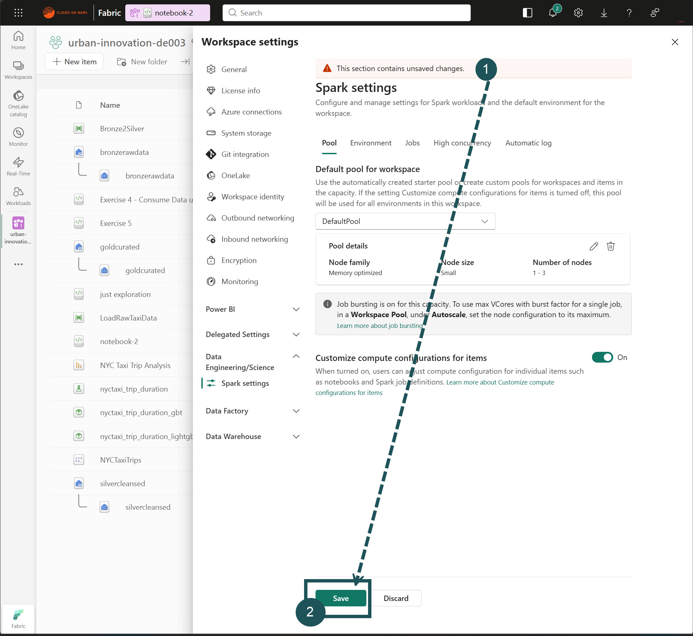


> [!IMPORTANT]  
> Jeśli zmienisz domyślny pool ze Starter Pool na Custom Spark pool, sesja może startować dłużej (ok. 3 minut).

6. **Weryfikacja**:
   - Sprawdź, czy nowy Spark pool jest widoczny w ustawieniach twojego workspace.
   - Upewnij się, że dla tego nowego Spark pool włączone jest dynamiczne wykonywanie jobów.


Nowy Spark pool z dynamiczną alokacją i autoskalowaniem może znacznie poprawić sprawność i wydajność przetwarzania danych. Porównaj czasy wykonania jobów i wykorzystanie zasobów przed wdrożeniem nowego Spark pool i po nim, żeby zmierzyć poprawę.


# Sprawdź V-Order

V-Order to optymalizacja plików Parquet stosowana w czasie zapisu. Przyspiesza odczyt w silnikach obliczeniowych Microsoft Fabric, takich jak Power BI, SQL i Spark. Stosuje sortowanie, kompresję i inne optymalizacje, co obniża koszty i poprawia wydajność.

W tym ćwiczeniu sprawdzisz, czy tabela została zapisana z optymalizacją V-Order, czy bez niej. 

> [!NOTE]
> Stan na wrzesień 2026 roku: w nowych workspace V-Order jest domyślnie wyłączony (`spark.sql.parquet.vorder.default=false`, profil `writeHeavy`). Do włączania i wyłączania używaj właściwości `spark.sql.parquet.vorder.default`. Starsze ustawienie `spark.sql.parquet.vorder.enable`, widoczne na zrzucie ekranu, zostało usunięte w Runtime 1.3.

1. **Przygotuj środowisko**:
   - Utwórz nowy Notebook w swoim workspace.
   - Załaduj dużą tabelę do DataFrame, żeby przetestować działanie V-Order.

2. **Przygotuj eksperyment**:
   - W pierwszej komórce Notebooka wyłącz optymalizację V-Order i zapisz DataFrame jako nową tabelę.
   - W osobnej komórce włącz optymalizację V-Order i zapisz DataFrame jako kolejną tabelę.
   - Uruchom obie komórki, żeby utworzyć dwie wersje tabeli: jedną z włączonym V-Order i jedną bez V-Order.
     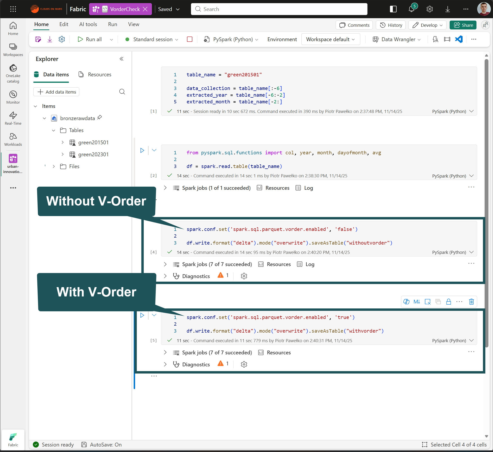

3. **Sprawdź właściwości plików**:
   - Przejdź do Lakehouse, a potem do Lakehouse Explorer.
   - Znajdź swoje tabele, kliknij trzy kropki obok nazwy tabeli i wybierz "View Files".
   - Wejdź do folderu `_delta_log` i otwórz pliki JSON obu tabel.
     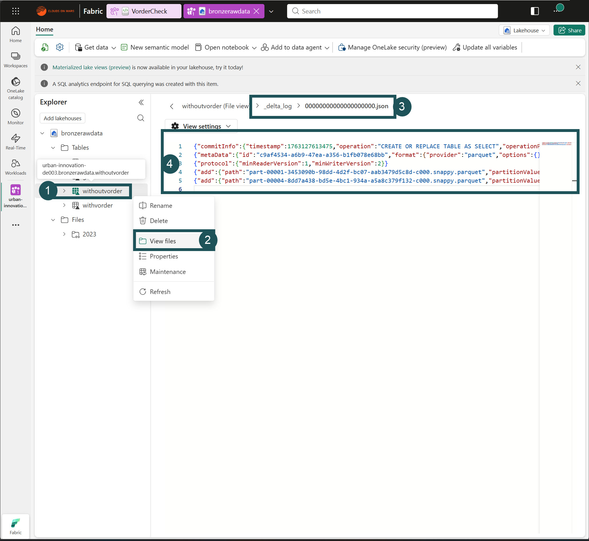

4. **Porównaj zawartość plików**:
   - Sformatuj pliki JSON, żeby łatwiej je porównać.
   - Poszukaj oznaczeń optymalizacji V-Order. Zwykle są w sekcji tags w logu JSON.
   - Porównaj liczbę wierszy wyjściowych i rozmiar danych wyjściowych w bajtach między tabelą zapisaną z V-Order a tabelą zapisaną bez V-Order.
     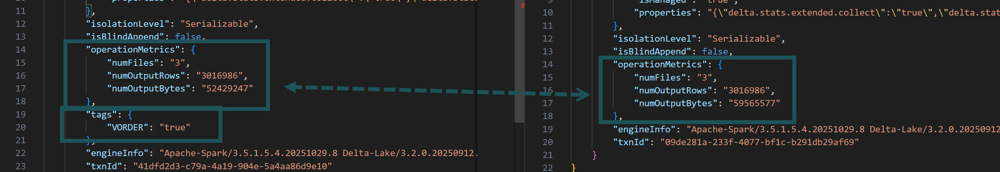


Przeczytaj [dokumentację Microsoft o optymalizacji Delta i V-Order](https://learn.microsoft.com/en-us/fabric/data-engineering/delta-optimization-and-v-order?tabs=sparksql), żeby lepiej zrozumieć temat i jego kontekst. Gdy wiesz, jak działa V-Order i na co wpływa, świadomie zdecydujesz, czy używać go w swojej strategii przechowywania i przetwarzania danych. Pamiętaj: celem jest nie tylko sprawdzić, czy V-Order jest zastosowany, ale też zrozumieć jego korzyści i konsekwencje.

# Merge

Polecenie MERGE w Delta Lake pozwala aktualizować tabelę Delta z użyciem zaawansowanych warunków. Poleceniem MERGE zaktualizujesz tabelę docelową danymi z tabeli źródłowej, widoku albo DataFrame. Obecny algorytm nie jest jednak w pełni zoptymalizowany pod kątem wierszy niezmodyfikowanych. Zespół Microsoft Spark Delta wdrożył własną optymalizację Low Shuffle Merge. Wyklucza ona niezmodyfikowane wiersze z kosztownej operacji shuffle, która jest potrzebna do aktualizacji dopasowanych wierszy.

Optymalizacją steruje konfiguracja [spark.microsoft.delta.merge.lowShuffle.enabled](https://learn.microsoft.com/fabric/data-engineering/low-shuffle-merge), domyślnie włączona w runtime. Nie wymaga zmian w kodzie i jest w pełni zgodna z dystrybucją open source Delta Lake. Więcej o scenariuszach użycia Low Shuffle Merge przeczytasz w artykule Low Shuffle Merge optimization on Delta tables.

## Zarządzanie danymi NYC Green Taxi za pomocą operacji Merge

Przećwicz obsługę danych w Fabric Spark: załaduj, zaktualizuj i wstaw dane NYC Green Taxi. Użyj instrukcji Merge, żeby zarządzać rekordami finansowymi z różnych okresów.

1. **Zbierz dane**:
   - Pobierz dane NYC Green Taxi z kilku miesięcy i lat z oryginalnego źródła: [NYC TLC Trip Record Data](https://www.nyc.gov/site/tlc/about/tlc-trip-record-data.page).
   - Wybierz konkretne okresy, na których się skupisz, na przykład różne miesiące albo lata.

2. **Załaduj dane do warstwy bronze**:
   - Wybierz dowolną metodę i załaduj pobrane dane taxi do warstwy „bronze” w Fabric Spark.
   - Utwórz i skonfiguruj tabele potrzebne do przechowywania danych taxi. Zadbaj, żeby zawierały metryki finansowe, takie jak przychód na taksówkę.

3. **Przygotuj scenariusze**: 
   - Opracuj dwa scenariusze:
     a. **Aktualizacja historyczna**: przygotuj zbiór danych z jednego z miesięcy ze zmienionymi kwotami, żeby zasymulować potrzebę korekty danych historycznych.
     b. **Wstawianie warunkowe**: określ warunki dla nowych danych (np. przejazdy z nowego miesiąca, zmiany opłat), które mają powodować wstawienie rekordów do osobnej tabeli.

4. **Zbuduj instrukcje Merge**:
   - W scenariuszu „Aktualizacja historyczna” napisz instrukcję Merge, która aktualizuje istniejące rekordy w warstwie bronze&silver poprawionymi danymi na podstawie unikalnych identyfikatorów.
   - W scenariuszu „Wstawianie warunkowe” zbuduj instrukcję Merge, która wstawia nowe rekordy do innej tabeli, gdy spełnione są określone warunki, na przykład pojawiły się nowe przejazdy albo zmieniły się opłaty.

5. **Uruchom i zweryfikuj**:
   - Uruchom obie instrukcje Merge w swoich Notebookach Fabric Spark.
   - Sprawdź wyniki: czy warstwy bronze i silver poprawnie odzwierciedlają korekty historyczne i czy osobna tabela zawiera nowe albo zaktualizowane rekordy.


[//]: # ()
[//]: # (## Dostosuj runtime za pomocą Environment)

[//]: # (![Monitoring]&#40;./../media/extra/18.jpg&#41;)

[//]: # (![Monitoring]&#40;./../media/extra/19.jpg&#41;)

[//]: # (![Monitoring]&#40;./../media/extra/20.jpg&#41;)

[//]: # (![Monitoring]&#40;./../media/extra/21.jpg&#41;)

[//]: # (![Monitoring]&#40;./../media/extra/22.jpg&#41;)

[//]: # (![Monitoring]&#40;./../media/extra/23.jpg&#41;)

[//]: # (![Monitoring]&#40;./../media/extra/24.jpg&#41;)

[//]: # ()
[//]: # ()
[//]: # (## DW vs Lakehouse?)

[//]: # (![DW czy Lakehouse]&#40;https://microsoft.github.io/fabricnotes/images/notes/04-lakehouse-vs-warehouse.png&#41;)

[//]: # ()
[//]: # (![Dwa endpointy]&#40;https://microsoft.github.io/fabricnotes/images/notes/12-sql-endpoints.png&#41;)

[//]: # ()
[//]: # (## SaaS vs PaaS)

[//]: # (* ![Podstawy Fabric]&#40;https://microsoft.github.io/fabricnotes/images/notes/03-fabric-saas-product.png&#41;)

[//]: # ()
[//]: # (## Licencjonowanie Fabric)

[//]: # (* ![Licencjonowanie Fabric]&#40;https://microsoft.github.io/fabricnotes/images/notes/13-fabric-licensing.png&#41;)

[//]: # ()
[//]: # (## Interfejs Fabric)

[//]: # (* ![Podstawy Fabric]&#40;https://microsoft.github.io/fabricnotes/images/notes/02-understand-fabric-ui.png&#41;)

[//]: # ()
[//]: # (## Fabric Capacities)

[//]: # (* ![Podstawy Fabric]&#40;https://microsoft.github.io/fabricnotes/images/notes/08-fabric-lingo-part-1.png&#41;)
